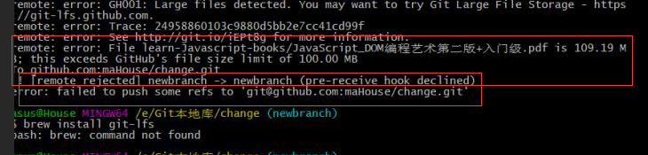
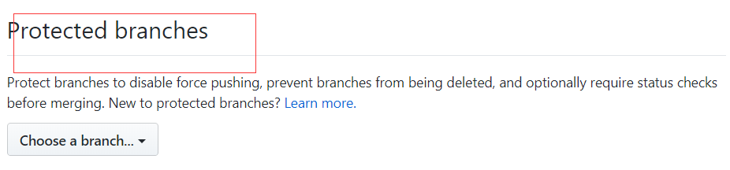

# sec-change
CSS揭秘，对CSS的再一次学习

除此之外呢，，我上个版本库出现了问题，奈何的是，我没解决掉，现在记录下来，等有时间解决，或者碰到比我厉害的人，帮我看看什么问题！

错误引起的原因是，往我的第一个版本库里上传一堆PDF书，可惜的是里面有大小超过100M的，错误的原因是权限问题

由此，开始第一次找解决办法，**第一次在网上看到去GitHub里的Protected branches里把Develop权限给打上勾就行了**，于是就在下班的时候，在网上找这个设置项在哪里！

找来找去，发现根本没有发现在哪里！找了两个晚上，最后惊喜的是找到了和博主案例很像的选项，不过不是罢了啊!！

在StackOverflow上，有个哥们说GitHub的UI设计变了，所以我就再三的找，无论从哪个settings进去，可以说是没有找到一摸一样的，可惜了啊！！偶然看到一个哥们把他的邮箱留了下来，我就给他发送邮件，可惜他用的是GitLab。

找到的这个有用？？根本没毛用，修改后，问题还是老问题。

没办法再找办法，去搜搜，发现是个大文件传输设置的问题，于是就有了你看到的git lfs,去下载large file storage这个软件，很快下载下来，开始见证奇迹了啊！！

奇迹就是超过响应期，自我感觉是寝室的网速慢，第二天屁颠屁颠的早一个小时跑到公司，用公司的网见证奇迹。

还是不行，这次问题是什么，我忘了，截图也忘了保存哪里了！！不过可以直接在change的版本库里直接运行就能看到问题的诞生。

我的第一个版本库，就这样没了，索性就在重建一个分支吧，呵呵的是，分支不分支的对解决问题没卵用！！这个newbranch就是我后面遇到的同样的问题！！

自我感觉是，我把文件删掉，并改写历史纪录就行了，可惜也没用！！

没辙的时候，我就放弃了！！开始重建一个新的版本库，从头开始新的快乐生活！

把问题留下来，，等人来帮帮看看吧！！