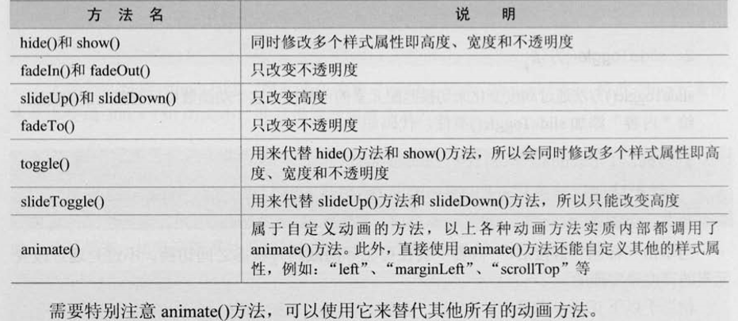

### 锋利的jQuery学习 ###

**第一章**
#### 1.window.onload与$(ready).reday(function() {})的区别 与$(window).load(function(){})的区别####
#### 2.$与jQuery的关系 ####
#### 3.更多的值得学习的框架 ####
mootools、YUI这两个框架好好学习一下，

①、end()，jQuery的遍历方法，意思是结束当前链条中的最近的筛选操作，并将元素还原为之前的状态。

②、为代码添加注释
	
	//在一个id为table的表格里的tbody中，每行的最后一列中的checkbox如果
	//没有被禁用，则把他的背景颜色调味红色
	$("#table > tbody > tr:has( td:last:has(:checkbox:enabled) )" ).css('background', 'red');

③、jQuery对象和DOM对象

jQuery对象通过jQuery选择器获取的对象，这个对象是jQuery独有的，可以享受jQuery的方法，而DOM对象是文档对象，想要表达同样的意思，两者也不能用一样的方式。

④、jQuery对象和DOM对象的两种转换方法

jQuery对象是一个数组对象，可以用[index]和get[index]的方法得到相应的DOM对象。

jQuery对象转化为DOM对象

	a、	var $cr = $('#cr');//jQuery对象
		var cr = $cr[0];//DOM对象
		alert(cr.checked);

	
	b、	var $cr = $('#cr');//jQuery对象
		var cr = $cr.get(0);//DOM对象
		alert(cr.checked);//检测

DOM对象转化为jQuery对象

	var cr = document.getElementById('cr');//DOM对象
	var $cr = $(cr);//jQuery对象

⑤、实例研究

	<input type="checkbox" id="cr"/><label for="cr">我已经阅读了上面制度</label>

验证方式

a、DOM验证方式

	$(document).ready(function() {
	
		var $cr = $('#cr');
		var cr = $cr[0];
		$cr.click(function() {
			if (cr.checked) {//DOM的判断方式
				alert("感谢您的支持！！！");
			} 
		});
	})

b、jQuery的验证方式

	$(function() {
		var $cr = $('cr');
			//cr = $cr.get(0);

		$cr.click(function() {
			if ( $cr.is('checked') ) {
				alert("感谢您的支持与厚爱！！")
			}
		})
	})

⑥、解决jQuery和其他库冲突问题

一种是jQuery库在其他库之后引用，我们能要用jQuery.noConflict()函数把$的控制权交给其他的JavaScript库，以jQuery库和prototype库为例子

	
jQuery函数作为jQuery对象的制造工厂，自定义一个快捷方式，可以进行如下操作

	var $j = jQuery.noConflict();
	$j( function() {//使用jQuery
			jQuery('p').click( function() {
				alert( jQuery( this ).text() );
			} );
	 	} )

	$('pp').style.display = 'none';//使用prototype

$j就是我们自定义的名字，也可以用其他的名字，如果想用$还不用管其他库的$()方法，还不用自定义名称
，当然不会与其他库冲突，可用

first

	jQuery.noConflict();
	jQuery( function ( $ ) {
		$('p').click( function() {
			alert( $( this ).text() );
		 } );
	} )

	$('pp').style.display = 'none';

sec

	jQuery.noConflict();
	( function ( $ ) {//定义匿名函数并设置形参为$,匿名函数内部的$均为jQuery
		$('p').click( function() {//继续使用$()方法
			alert( $( this ).text() );
		 } );
	} )(jQuery);//执行匿名函数且传递实参jQuery

	$('pp').style.display = 'none';//使用prototype

二种是jQuery库在其他库之前导入

	jQuery( function() {
		jQuery('p').click(...);
	} );

	$('pp').style.display = 'none';

$的控制权交出来，这是在jQuery库后导入，如果前面导入的话，就不用了

### 第二章 ###

选择器是jQuery的根基，在对事件处理、遍历DOM和Ajax操作都依赖于此，熟练使用大有裨益。

选择器就是使用某种方式找到HTML元素，是指表现为某种样式。选择器有以下几种

标签选择器、ID选择器、类选择器、后代选择器(E F)、群组选择器(E1,F,E2)、通配符(*)，这几种所有浏览都支持的，还有几种部分浏览器支持的如：伪类选择器(E:Pseudo-Elements)、子选择器(E > F)、临近选择器(E + F)、和属性选择器(E[attr])。

实例见代码

jQuery选择器分为基本选择器、层次选择器、过滤选择器和表单选择器，下面我们做介绍
#### 1.基本选择器 ####
组简单的选择器，通过id、class、标签名和*等来查找DOM元素

	$('#one')
		.css('background', '#bbffaa');
	
	$('*')
		.css('background', '#bbffaa');//改变所有元素的背景色

	$('span, #two')
		.css('background', '#bbffaa');
#### 2.层次选择器 ####
顾名思义通过元素之间的层次关系来获取特定的元素，例如后代、子元素、相邻元素(+)、同辈元素(~)，这些都是通过层次选择器来得到的。相邻是紧接着的下一个，同辈元素是某个元素后面的所有某个元素，看看实例。

	$('.one + div')
		.css('background', '#bbffaa');

class为one的下一个div元素的背景色，代替方案：

	$('.one').next('div')
		.css();

	$('#prev~div').css();

id为prev元素之后的所有div兄弟元素，代替方案：

	$('#prev').nextAll('div');//之后的

不同于

	$('#prev').siblings('div');//同辈无前后
#### 3.过滤选择器 ####
过滤选择器根据不同的过滤规则可分为基本过滤、内容过滤、可见性过滤、属性过滤、子元素过滤、表单对象过滤选择器。

**基本过滤选择器**

	:first :last :not(selector) :even :odd :eq(index) :gt(index) :lt(index) :header :animated

for example:

	$('input:not(.myClass)');//选取的就是class不是myClass的input元素
	
	$('div:animated')//正在执行顺序动画的div元素
	
	$(':animated').css();

**内容过滤选择器**

体现在它包含的子元素或文本内容上

	:contains(text)//选取包含文本内容为text的元素
	:empty//不包含子元素或者文本元素
	:has(selector)//选取含有所匹配元素的元素，不仅仅是文本
	:parent//选取含有子元素或文本的元素

for example:

	$('div:contains(di)').css();//文本中含有di的div
	$('div:empty').css();//无子元素的div
	$('div:has(mini)').css();//改变class含有mini的div
	$('div:parent').css();//改变含有子元素的元素

**可见性过滤选择器**

根据元素的可见和不可见状态来选择相应的元素

	:hidden//选取不可见的元素，$(':hidden')包括3中类型，input里的type为hidden，或者样式里的display为none，再有就是visibility为hidden，3中类型，如果想更有针对性，可以用$('div:hidden');

	:visible//选取可见的div元素

**属性过滤选择器**

通过元素相应的属性来获取元素。

	[attribute]  选出有此属性的元素  $('div[id])选出含有属性id的元素
	
	[attribute=value] 选出属性值为value的元素 $('div[title=test])选出含有title为test的元素
	
	[attribute!=value] 与2相反
	
	[attribute^=value] 选出属性值以value开始的元素 $('div[title^=test])选出title的属性值以test开始的div

	[attribute$=value] 选出属性值以value结束的元素 与上反

	[attribute*=value] 选出含有属性值含有value的元素

	[selector1][selector2][selectorN] 多个属性选择器合并成一个属性选择器 $('div[id][title$=test]')

**子元素过滤选择器**

	:nth-child(index/even/odd/equatio)  :first-child :last-child :only-child(某个元素是他父元素中唯一的子元素)

	$('div.one :only-child').css();

**表单对象属性过滤选择器**

	:enabled//$('#form :enabled)选取可用元素 :disabled//选取不可用的元素  :checked//$('input:checked')选取被选中的元素，单选框和复选框 :selected//$('select :selected')选取被选中的选项元素（下拉列表中的）

示例见代码

**表单选择器**

	:input   //选取所有的input textarea select button 元素
	
	:text    //所有的单行文本

	:password //所有的密码框

	:radio    //所有的单选框

	:checkbox //所有的多选框

	：submit  //所有的提交按钮

	:image    //所有的图像按钮

	:reset    //所有的重置按钮

	:button    //所有的按钮

	：file     //所有的上传区域

	:hidden    //所有的不可见元素，参看上面讲解

HTML示例代码见

### 第三章 jQuery中的DOM操作 ###
文档对象模型，一种与浏览器、平台、语言无关的接口，使用该接口可以轻松的访问页面中所有的标准组件，如获取和操作网页中的数据、脚本和表现层对象。

DOM分为3个方面，DOM Core(核心）、HTML-DOM和CSS-DOM。

DOM Core不属于JavaScript，属于DOM，任何支持DOM的程序设计都可以用，也可以处理任何一种使用标记语言编写的文档，例如XML。

getElementById()、getElementsByTagName()、getAttribute()、setAttribute()这些事DOM Core的组成部分。

HTML-DOM

	document.forms;//HTML-DOM提供了一个forms对象

	element.src;

CSS-DOM，针对CSS进行的操作

	element.style.color = 'red';

**插入节点的方法**

	append()  //相匹配的元素内部增加，加到了元素内部的最后面
	appendTo()//与上面相反，把匹配元素追加到某个元素后面
	prepend() //向某个匹配元素内部前置内容
	prependTo //与上相反
	after()   //在某个匹配的元素后面插入内容
	before()  //在某个元素的前面插入内容
	insertAfter()//将匹配的元素插入到指定的元素后面
	insertBefore()//将匹配的元素插入到指定的元素的前面
### 第四章 ###
事件绑定

	bind(type , fn)   hover()  toggle()

#### 事件冒泡 ####
事件里的元素具有的点击事件，元素也具有了点击事件，为阻止这类问题发生，再有某些元素有默认的属性，比如提交，我们也要防止类似事情发生，做法如下：

	event.stopPropagation();//阻止冒泡

	event.preventDefault();//阻止默认行为

代替上述两者：

	return false;

JavaScript不支持事件捕获

解除绑定 unbind()，只用一次，用过之后就解除绑定的用one()，这个用法和bind()类似

模拟操作用trigger(type, [,data])、triggerHandler()绑定特定事件而取消默认的操作

	$("div").trigger("click!");//不会触发其他事件

fadeIn()、fadeOut()只改变元素的不透明度，前者是是从display:none到透明度为0%，后者是从透明度为0%到display:none.

slideUp()和slideDown()只改变元素的高度，当一个元素的display属性值为none时，slideDown()表示元素从上到下延伸显示，slideUp()相反

动画方法说明

### 第五章 ###

表单有3个基本组成部分

表单标签

表单域：文本框、密码框、隐藏域、多行文本框、复选框、单选框、下拉选框、文本上传框等

表单按钮：提交按钮、复位按钮一般按钮

案例部分见代码[锋利的jQuery学习-第五章-1.html](锋利的jQuery学习-第五章-1.html)

### 第六章 ###
Ajax的优势：不需要插件、优秀的用户体验、提高Web程序性能（传统数据提交是通过Form，数据获取是通过刷新页面，而Ajax模式只用了XMLHttpRequest对象向服务器提交希望提交的数据，按需发送）、减轻服务器和带宽的负担

Ajax的不足：浏览器对XMLHttpRequest对象的支持不足、破坏后退前进按钮的正常功能、搜索引擎的支持不足、开发和调试工具缺乏

Ajax的核心是XMLHttpRequest对象，是Ajax实现的关键--发送异步请求、接收响应以及执行回调都是通过它来完成。

### 第七章插件的使用和写法 ###

jQuery插件主要分为3类：

#### 1.封装对象方法的插件 ####
将对象方法封装起来，用于对通过选择器获取的jQuery对象进行操作，一种常见的插件。直接与内核联系起来。

#### 2.封装全局函数的插件 ####
将独立的函数加到jQuery命名空间下，常用的jquery.noConflict()方法、jQuery.ajax()以及jQuery.trim()方法，都是jQuery内部作为全局函数的插件附加到内核上去的。

#### 3.选择器插件 ####

我们想用自己做的选择器，如color(red)来选择所有红色字的元素

**插件的基本要点**

文件名为jquery.[plugins-name].js

所有的对象方法都应当附加到jQuery.fn对象上，全局函数附加到jQuery对象上

插件内部，this指向的是当前通过选择器获取的jQuery对象，不像一般的方法那样，如click()，内部的this指向的是DOM元素

可以通过this.each()来遍历所有元素

所有的方法或函数插件，都应当以分号结尾，为了压缩时不出错，更稳妥是插件开头加上一个分号

插件应该返回一个jQuery对象，以保证插件的可链式操作。除非插件需要返回的是一些需要获取的量，例如字符串或者数组

避免在插件内部使用$为jQuery对象的别名，应该用jQuery来表示，避免冲突，可用闭包来解决这个问题，以继续使用$

常见的jQuery插件形式为

	(function() { /*这里是代码*/ })();

可以传递参数

	;(function($){ /*这里是代码*/ })(jQuery);
更好的兼容性加了个分号，$是作为形式参数，代码块可用$来代替jQuery,jQuery作为实际参数传递给匿名函数，这个是常见的jQuery插件的结构。

	;(function($){
		//这里编写插件的代码，可以继续使用$作为jQuery的别名
		//定义一个局部变量foo，仅函数内部可以访问，外部无法访问
		
		var foo;
		var bar = function() {
			/*
				在匿名函数内部都可以访问foo，即便是匿名函数外部调用bar()的时候，也可以在bar()的内部访问到foo，匿名函数的外部访问不到foo
			*/
		}
		
			/*
				下面的语句让匿名函数内部的函数bar()*/})();
