## 学习JavaScript数据结构和算法 ##
#### 1.控制结构 ####
①、条件语句

if...else以及变形

②、循环

③、面向对象编程OOP

	var Book = function(title,page) {
		this.title = title;
		this.page = page
	}//还有一种就是new出来

#### 2.数组 ####
数组是最简单的内存数据结构，在JS里我们可以存储不同类型的值

把值放到第一个位置上，数组的长度增加，length由原来的length变为length+1，这个新的值则是length-length的地方，实现原理是：

	for ( var i = numbers.length; i >= 0; i-- ) {
	
		numbers[ i ] = numbers[ i - 1 ];
	}
	
	numbers[0] = -1; 

JS仅仅支持一维数组，不支持矩阵，但可以用嵌套数组来实现矩阵或多维数组，参照于乘法口诀

**排序**

sort排序

	numbers.sort( function( a, b ) {
	
		return a - b;
	} );

等价于

	function compare( a, b ) {
		if ( a < b ) { return -1 };
		if ( a > b ) { return 1 };
		return 0;
	}

	numbers.sort( compare );

自定义排序

我们可以对任何对象类型的数组排序

#### 3.栈 ####
数组里面我们可以在其任意位置上删除或添加元素，但有时候我们需要一种在添加或删除元素时有更多控制的数据结构。有两种数据结构类似于数组，但在添加和删除元素时更为可控，他们就是栈和队列。

栈是一种后进先出（LIFO）原则的有序集合。新添加的或待删除的元素都保存在栈的末尾，称作栈顶，另一端叫做栈底。在栈里，新元素都靠近栈顶，旧元素都接近栈底。

last input first output 

栈也被用在编程语言的编译器和内存中保存变量、方法调用等。

 **栈的创建**

创建一个类表示栈，先声明这个类：

	function Stack() { //各种属性和方法的声明 }

首先，需要一种数据结构来保存栈里的元素，可以选择数组：

	var items = [];

下面为栈声明一些方法：

	push(element(s)):添加一个或多个新元素到栈顶

	pop():移除栈顶的元素，同时返回被移除的元素

	peek():返回栈顶的元素，不对栈做任何修改（不会移除栈顶的元素，仅仅返回它）

	isEmpty():如果栈里没有任何元素就返回true，否则返回false
	
	clear():移除栈里的所有元素

	size():返回栈里的元素个数。和数组的length属性类似

实现的第一个方法就是push，往栈里添加新元素，只会添加新元素到栈顶，也就是栈的末尾

	this.push = function( element ) {

		items.push( element );
	}
实现pop方法，遵从LIFO原则，移除的是最后添加进去的元素
	
	this.pop = function() {
		return items.pop();
	}

只能用push和pop方法添加和删除栈中的元素，我们的栈也就遵从了LIFO原则，一些额外的辅助方法，如果我们想知道栈里最后添加的元素是什么，可以用peek方法，这个方法返回栈顶的元素

	this.peek = function() {
	
		return items[items.length-1];
	}

实现isEmpty方法，如果栈为空返回true，否则返回false

	this.isEmpty = function() {

		return items.length == 0;
	}

使用isEmpty就能简单的判断内部数组的长度是否为0。

对于集合，最好用size代替length，因为栈的内部使用数组保存元素，所以简单的返回栈的长度

	this.size = function() {

		return items.length;
	}

clear方法的实现，用来移除栈里所有的元素，把栈清空

	this.clear = function() {

		items = [];
	}
也可以用pop方法，把数组元素全部移除，实现了clear

检查栈里的内容，用辅助方法，print。把栈里的元素都输出到控制台

	this.print = function() {
		
		console.log(items.toString());
	}

OK!完成了创建栈。

栈的完整代码

	function Stack() {
	
		var items = [];

		this.push = function( element ) {
			items.push( element );
		};
		
		this.pop = function() {
			
			return items.pop();
		};

		this.peek = function() {
			
			return items[ items.length-1];
		};
		this.isEmpty = function() {
			
			return items.length == 0;
		};
		this.size = function() {
			
			return items.length;
		};
		this.clear = function() {
			
			items = [];
		};
		this.print = function() {
		
			console.log( items.toString() );
		};
	}

使用Stack类

首先，初始化Stack类，并验证栈是否为空，输出true，因为还没有往栈里添加元素

	var stack = new Stack();
	console.log(stack.isEmpty());

接下来，往栈里添加一些元素，可以是任意类型的元素

	stack.push(5);
	stack.push("1");

如果调用peek方法，将会输出字符串“1”，因为是最后一个添加的元素

	console.log(stack.peek());

再添加一个元素：

	stack.push(11);
	console.log(stack.size());
	console.log(stack.isEmpty());

我么往栈里添加了11，调用size方法，输出为3，调用isEmpty方法，会看到输出了false，因为栈里有3个元素，不是空栈，最后添加一个元素：

	stack.push(15);

#### 实战 ####
生活中我们使用十进制，计算机科学里所有内容都是用二进制数字表示的（0和1），计算机并没有十进制和二进制相互转化的能力。

把十进制转化为二进制，我们可以将十进制数字和2整除，直到结果是0为止

	function divideBy2(decNumber) {
		
		var remStack = new Stack(),
			rem,
			binaryString = '';
	
		while (decNumber > 0) {
			rem = Math.floor(decNumber % 2);
			remStack.push(rem);
			decNumber = Math.floor(decNumber / 2);
		}

		while (!remStack.isEmpty()){
			binaryString += remStack.pop().toString();
		}
		return binaryString;
	}

当结果满足和2做整除的条件，我们会获得当前结果和2的余数，放到栈里。然后让结果和2做整除。JS有数字类型。不会区分是整数还是浮点数。因此用Math.floor函数让除数法的操作仅返回整数部分，最后用pop方法把栈中的元素都移除，把出栈的元素变成连接成字符串。

**实例平衡圆括号和汉诺塔**

### 4.队列 ###

队列遵循FIFO（First In First Out），先进先出原则，是一组有序的项。队列在尾部添加新元素，并在顶部移除元素。新添加的元素必须排在队列的末尾。

**创建队列**

从基本的声明类开始：

	function Queue() {
		
		//属性和方法
	}

首先需要一个用于存储队列中元素的数据结构。我们用数组：

	var items = [];

队列可用的方法

	enqueue( elements ):向队列尾部增加一个或多个新的项
	
	dequeue():移除队列的第一项，并返回被移除的元素

	front():返回队列中第一个元素--最先被添加，也将是最先被移除的元素。队列不做任何变动（不移除元素，只返回元素信息--与Stack类的peek方法类似

	isEmpty():如果队列不包含任何元素，返回true,否则返回false

	size():返回队列包含的元素个数，与数组的length属性类似

先实现enqueue方法，负责向队列里添加新元素，只能向队列的末尾添加

	this.enqueue = function( element ) {

		items.push( element );
	}

由于队列遵循先进先出原则，最先添加的项也是最先被移除，我们用shift方法来实现，会从数组中移除储存在索引0的元素。

	this.dequeue = function() {

		return items.shift();
	}

我们用enqueue和dequeue方法来添加和移除元素，确保了Queue类遵循先进先出原则。

如果想知道队列最前面的项是什么，可以用front方法

	this.front = function() {

		return items[];
	}

下一个是isEmpty方法，如果队列为空返回true，否则返回false

	this.size = function() {
		
		return items.length;
	}

增加一个print方法

	this.print = function() {

		console.log( items.toString() );
	}

完整的代码：

	function Queue() {
	
		var items = [];
	
		this.enqueue = function( element ) {
			items.push( element );
		};
		
		this.dequeue = function() {
			return items.shift();
		};
		
		this.front = function() {
			return items[0];
		};

		this.isEmpty = function() {
			return items.length == 0;
		};

		this.clear = function() {
			items = [];
		};

		this.size = function() {
			return items.length;
		};

		this.print = function() {
		
			concole.log( items.toString() );
		};
	}

使用Queue类（队列类）

首先就是实例化刚刚创建的Queue类，并进行验证（是否为空）

	var queue = new Queue();
	console.log( queue.isEmpty() );

接下来添加元素进去，可以是任何类型的元素

	queue.enqueue("John");
	queue.enqueue("Jack");

**优先队列**

元素的添加和移除是有优先级的，实际的例子是机场登机有头等舱和商务舱与经济舱的区别，医院有急诊室的区别

实现一个优先队列，有两种选项：设置优先级，然后在正确的位置添加元素；或者用入列操作添加元素，然后按照优先级移除它们，示例中我们将会在正确的位置添加元素，因此可以对他们使用默认的出列操作：

	function PriorityQueue() {
	
		var items = [];
		
		function QueueElement ( element, priority ) {
			
			this.element = element;
			this.priority = priority;
		
		}

		this.enqueue = function( element, priority ){
			
			var queueElement = new QueueElement( element, priority );
			
			if ( this.isEmpty ) {
				items.push( queueElement );
			} else {
				var added = false;
				for (var i = 0; i < items.length; i++) {
					if ( queueElement.priority < items[i].priority ) {
						items.splice(i, 0, queueElement);
						added = true;
						break;
					}
				}
				if ( !added ) {
					items.push(queueElement);
				}
			}
		}
	}

默认的Queue类和PriorityQueue类实现上的区别是，要向PriorityQueue添加元素，要创建一个特殊的元素。这个元素包含了要添加到队列的元素（可以是任意类型）以及在队列中的优先级。

如果队列为空，可以直接将元素入列，否则，就需要比较该元素与其他元素的优先级。当找到一个比要添加的元素的Priority值更大（优先级更低）的项时，就把新元素插入到它之前（所以，对于其他优先级相同，但是先添加到队列的元素，我们遵循同样的先进先出原则）。要做到这一点，我们只需要用splice方法即可，一旦找到priority值更大的元素，就插入新元素并终止循环。这样，队列也就根据优先级排序了。

如果要添加的元素priority值大于任何已有的元素，把它添加到队列的末尾就行。

	var priorityQueue = new PriorityQueue();
	priorityQueue.enqueue("John", 2);
	priorityQueue.enqueue("Jack", 1);
	priorityQueue.enqueue("Camila", 1);
	priorityQueue.print();

第一个添加的元素是优先级为2的John。因为此前队列为空，所以他是队列中唯一的元素。接下来，添加了优先级为1的Jack。由于Jack的优先级高于John，它就成为了队列中的第一个元素，然后添加了优先级也为1的Camila。优先级相同被放到Jack之后

我们这里实现的优先队列成为最小优先队列，因为优先的值较小的元素被放置到队列最前面。最大优先队列与之相反。

**循环队列--击鼓传花**

孩子们围成一个圈，把花尽快的传给旁边的人，某一时刻传花停止，花在谁的手里，谁退出圆圈，知道剩下一个孩子

	function hotPotato( nameList, num ) {
		
		var queue = new Queue();
		for ( var i = 0; i < nameList.length; i++ ) {
		
			queue.enqueue( nameList[i] );
		}

		var eliminated = '';
		while( queue.size() > 1 ) {
		
			for ( var i = 0; i < num; i++ ) {
				queue.enqueue(queue.dequeue());
			}
			
			eliminated = queue.dequeue();
			console.log( eliminated + '在游戏中淘汰' );
		} 
		
		return queue.dequeue();
	}

	var names = ['John','Jack','Camila','Ingrid','Carl'];
	var winner = hotPotato(names, 7);
	console.log('胜利者:' + winner);

我们要用到Queue类，首先把所有的名字加入到队列，给定一个数字，然后迭代队列。从队列开头移除一项，再将其添加到队列的末尾，模拟击鼓传花（如果你把话给了旁边的人，你的危险就解除了）。一旦传递次数达到给定的数字，拿着花的人就被淘汰了（从队列中移除）。最后只剩下一个人的时候，就是胜者了。

### 5.链表 ###

第二章我们学习了数组这种数据结构，数组是一种很简单的存储数据序列的数据结构。下面我们会学习如何实现和使用链表这种动态的数据结构，这意味着我们可以从中任意添加或移除项，它会按需进行扩容。

要存储多个元素，数组或列表可能是最常用的数据结构，每种语言收实现了数组，这种数据结构非常方便，提供了一个便利的[]语法来访问她的元素。然而同样也是有缺点的：大多数语言中，数组的大小是固定的，从数组的起点或中间插入或移除项的成本很高，因为需要移动元素。

**链表存储有序的元素集合，****但不同于数组，链表中的元素在内存中并不是连续放置的。每个元素由一个存储元素本身的节点和指向下一个元素的引用（也成为指针或链接）组成。**如下图：

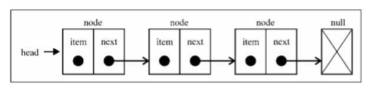

相对于传统的数组，链表的一个好处是，添加和移除元素的时候不需要移动其他元素。然而，链表需要使用指针，因此实现链表需要额外注意。数组的另一个细节是可以直接访问任何位置的任何元素，而想要访问链表中的一个元素，需要从头（表头）开始迭代列表直到找到所需的元素。

现实中也有一些链表的例子。例如康加舞队，每个人是一个元素，手就是链向下一个人的指针。可以向队列中增加人--只要找到想加入的点，断开连接，插入一个人，再重新连接起来。

另一个例子就是寻宝游戏。你有一条线索，这条线索是指向寻找下一个线索的地点的指针。你顺着这条链接去下一个地点，得到另一个指向再下一处的线索。得到列表中间的线索的唯一办法，就是从起点（第一条线索）顺着列表寻找。

还有个说明列表的最流行的例子，就是火车。一列火车是由一系列车厢组成。每节车厢都相互连接，你很容易分离一节车厢，改变它的位置，添加或移除它。每节车厢都是列表的元素，车皮间的连接就是指针，开始搞起链表和双向链表吧

**创建一个链表**

看看我们的LinkedList类的骨架

	function LinkedList() {
		
		var Node = function( element ) {
			this.element = element;
			this.next = null;
		};
		
		var length = 0,
			head = null;
		
		this.append = function( element ) {};
		this.insert = function( position, element ) {};
		this.removeAt = function( position ) {};
		this.remove = function( element ) {};
		this.indexOf = function( element ) {};
		this.isEmpty = function() {};
		this.size = function() {};
		this.toString = function() {};
		this.print = function() {};
	}

LinkedList数据结构还需要一个Node辅助类。Node类表示要加入列表的项。它包含一个element属性，即要添加到列表的值，以及一个next属性，即指向列表中下一个节点项的指针。

LinkedList类也有存储列表项的数量的length属性

另一个重要的是，我们还要存储第一个节点的引用。为此可以把这个引用存储在一个成为head的变量中

然后就是LinkedList类的方法。

	append(element):向列表中添加一个新的项
	
	insert(position,element):向列表的特定位置插入一个新的项
	
	remove(element):从列表中移除一项

	indexOf(element):返回元素在列表中的索引，如果列表中没有该元素则返回-1

	removeAt(position):从列表中的特定位置移除一项

	isEmpty():如果链表中不包含任何元素，则返回true，如果链表的长度大于0返回false

	size():返回链表包含的元素的个数。与数组的length属性类似

	toString():由于列表中使用了Node类，就要重新写继承JS对象默认的toString方法，让其只输出元素的值

#### 向链表尾部追加元素 ####
向LinkedList对象尾部添加一个元素时，可能有两种情况：列表为空，添加的是第一个元素，或者不为空，向其追加元素。

我们实现的append方法：

	this.append = function( element ) { 
		
		var node = new Node( element ),
			current;

		if ( head === null ) {

			head = node;
		} else {
			current = head;
			
			while( current.next ) {
				
				current = current.next;
			}

			current.next = node;
		}

		length++;
	};

首先需要做的是把element作为值传入，创建Node项

先来实现第一个场景：向为空的列表添加一个元素。当我们创建一个LinkedList对象时，head会指向null

如果head元素为null（列表为空），就意味着在向列表中添加第一个元素。因此要做的就是让head元素指向node元素。下一个node元素将会自动成为null

向一个空列表中添加一个元素

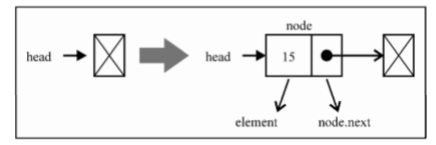

列表的最后一个节点的下一个元素始终是null

要向列表的尾部添加一个元素，首先需要找到最后一个元素，记住，我们只有第一个元素的引用，因此要循环访问列表，直到最后一项。为此，我们需要一个指向列表中current项的变量。循环访问列表时，当current.next元素为null时，我们就知道已经到达列表尾部。然后要做的就是让当前（也就是最后一个）元素的next指针指向想要添加到列表的节点。

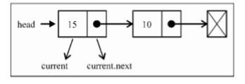

而当一个Node元素被创建时，它的next指针总是null

我们可以通过以下代码来使用和测试目前创建的数据结构：
	
	var list = new LinkedList();
	
	list.append(15);
	list.append(10);

**从链表中移除元素**

现在，我们看看如何从LinkedList对象中移除元素。移除元素也有两种场景：第一种是移除第一个元素，第二种是移除第一个以外的任一元素。我们要实现两种remove方法：第一种是从特定位置移除一个元素，第二种是根据元素的值移除元素。

根据给定位置移除一个元素的方法的实现：

	this.removeAt = function( position ) {
		
		if ( position > -1 && position < length ) {
			
			var current = head,
				previous,
				index = 0;
			
			if ( position === 0 ) {
				
				head = current.next;
			} else {
				
				while ( index++ < position ) {
					
					previous = current;
					current = current.next;	
				}
				
				previous.next = current.next;
			}
		
			length--;
		
			return current.element;
	
		} else {
		
			return null;
		}	
	};

该方法要得到需要移除的元素的位置，就要验证这个位置是否有效，从0到列表的长度（size - 1，因为索引是从0开始的）都是有效的位置，如果不是有效的位置，就返回null（意思就是没有从列表中移除元素）。

我们要从列表中移除第一个元素：

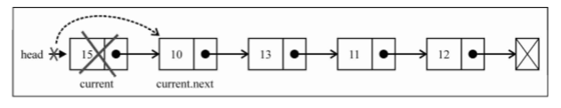

因此，如果要移除第一个元素，就要让head指向列表的第二个元素。我们将用current变量创建一个对列表中第一个元素的引用--我们还会用它来迭代列表。这样current变量就是列表中第一个元素的引用。如果head赋为current.next，就会移除第一个元素。

现在，假设我们要移除列表的最后一项或中间的某一项。为此，需要依靠一个细节来迭代列表，直到到达目标位置（我们用一个用于内部控制和递增的index变量）：current变量总是为对所循环列表的当前元素的引用。我们还需要一个当前元素的前一个元素的引用；它被命名为previous

因此，要从列表中移除当前元素，要做的就是将previous.next和current.next链接起来。这样，当前元素就会被丢弃到计算机内存中，等待着被垃圾回收器清除。

移除最后一个元素：

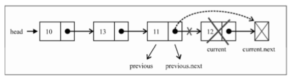

对于最后一个元素，当我们在跳出循环时，current变量将是对列表中最后一个元素的引用（要移除的元素）。current.next的值将是null（因为它是最后一个元素）。由于还保留了对previous元素的引用（当前元素的前一个元素），previous.next的值将变为current.next。

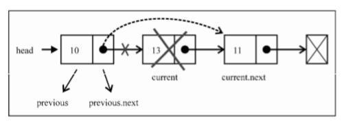

current变量是将要移除元素的引用。previous变量是要移除的前一个元素的引用。那么要移除current元素，需要做的就是将previous.next与current.next链接起来。逻辑是好使的

**在任意位置插入一个元素**

接下里实现insert方法，使用这个方法可以在任意位置插入一个元素

	this.insert = function( position, element ) {

		if ( position >= 0 && position <= length ) {
			
			var node = new Node( element ),
				current = head,
				previous,
				index = 0;
			
			if ( position === 0 ) {
				
				node.next = current;
				head = node;
			} else {
			
				while ( index++ < position ) {
				
					previous = current;
				
					current = current.next;
				}
		
				node.next = current;
				previous.next = node;
			}
		
			length++;
	
			return true;
		} else {
			return false;
		}
	};

由于我们处理的是位置，就要检查越界值，如果越界了就返回false值，表示没有添加项到列表中

现在我们要处理不同的场景。第一种场景，需要在列表的起点添加一个元素，也就是第一个位置

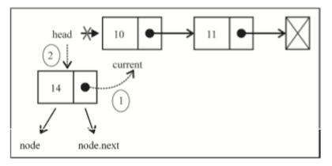

current变量是对列表中第一个元素的引用。要做的是把node.next的值设为current（列表中第一个元素）。现在head和node.next都指向了current。接下来要做的就是把head的引用改为node，这样列表中就有了一个新元素。

接下来处理第二种场景：在列表中间或尾部添加一个元素。首先我们要循环访问列表，找到目标位置。当跳出循环时，current变量将是对想要插入新元素的位置之后一个元素的引用，而previous将是对想要插入新元素的位置之前一个元素的引用。

这种情况下，我们要在previous和current之间添加新项。因此，首先把新项（node）和当前项链接起来，然后改变previous和current之间的链接。我们还要让previous.next指向node。

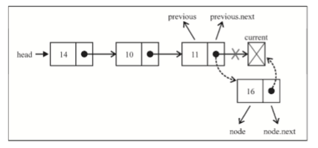

如果我们试想向最后一个位置添加一个新元素，previous将是对列表最后一项的引用，而current将是null。这种情况下，node.next将指向current，而previous.next将指向node，这样列表中就有了一个新的项

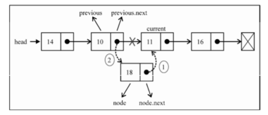

首先把node.next的值指向current，然后把previous.next的值指向node

**实现其他方法**

toString

它会把LinkedList对象转换成一个字符串，下面就是toString方法的实现：

	this.toString = function() {
		
		var current = head,
			string = '';
		

		while ( current ) {
			string = current.element;
			current = current.next;
		}
		
		return string;
	}

首先，要访问列表中的所有元素，就要有个起点，也就是head。我们会把current变量当作索引，控制循环访问列表。我们还要初始化用于拼接元素值得变量。

接下来就是循环访问列表中的每个元素。我们要用current来检查元素是否存在（如果列表为空，或是到达列表中最后一个元素的下一位（null），while循环中的代码就不会执行）。然后我们就得到了元素的内容，将其拼接到字符串中，最后，继续迭代下一个元素。

最后，返回列表中内容的字符串。

**indexOf方法**

indexOf是我们下一个要实现的方法。indexOf方法接受一个元素的值，如果元素找到就返回它的位置，否则返回-1.

	this.indexOf = function( element ) {
		
		var current = head,
			index = -1;

		while( current ) {

			if ( element === current.element ) {
				return index;
			}
			
			index++;
			
			current = current.next;
		}

		return -1;
	};

我们需要一个变量来帮助我们循环访问变量，这个变量就是current，他的初始值是head（列表的第一个元素--我们还要一个index变量来计算位置数。然后循环访问元素，检查当前元素是否是我们要找的。如果是，就返回它的位置，否则的话就继续计数，检查列表中的下一个节点。

如果列表为空，或到达列表的尾部（current = current.next将是null），循环就不会执行，如果没找到值，就返回-1

	this.remove = function(element) {

		var index = this.indexOf(element);
		
		return this.removeAt(index);
	};

我们已经有一个移除给定位置的一个元素的removeAt方法。现在有了indexOf方法，如果传入元素的值，就能找到他的位置，然后调用removeAt方法并传入找到的位置。

**isEmpty、size、getHead方法**

	this.isEmpty = function() {

		return length === 0;
	};

	this.size = function() {

		return length;
	};

	this.getHead = function() {

		return head;
	};

head变量是LinkedList类的私有变量（这意味着她不能在LinkedList实例外部被访问和更改，只有通过LinkedList实例才可以）。但如果我们需要在类的实现外部循环访问列表，就要提供一种获取类的第一个元素的方法。

#### 双向链表 ####

链表有多种不同的类型，就包括双向链表。双向链表和普通链表的区别是，链表中，一个节点只有链向下一个元素，双向链表，链表是双向的：一个链向下一个元素，另一个链向前一个元素

如图：

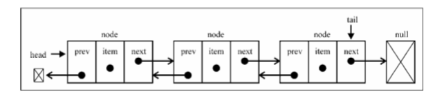

先从实现DoublyLinkedList类开始所需的变动开始：

	function DoublyLinkedList() {
		
		var Node = function( element ) {

			this.element = element;
			this.next = null;
			this.prev = null;
		};

		var length = 0;
		var head = null;
		var tail = null;

		//方法
	}

这里LinkedList类和DoublyLinkedList类之间的区别是，Node类有prev属性，一个新的指针，并且也有用来保存对列表最后一项的引用的tail属性。

双向链表提供了两种迭代列表的方法：从头到尾，或者反过来。我们也可以访问一个特定节点的下一个或前一个元素。在单项链表中，如果迭代列表时错过了要找的元素，就要从头开始再找，双向链表就不用了。

**在任意位置插入一个新元素**

与单项链表相似，区别是，链表只要控制一个next指针，双向链表要控制next和prev两个指针。

算法如下：

	this.insert = function( position, element ) {
		
		if ( position >= 0 && position <= length ) {

			var node = new Node( element ),

				current = head,
				previous,
				index = 0;

			if ( position === 0 ) {

				if ( !head ) {

					head = node;
					tail = node;
				} else {

					node.next = current;
					current.prev = node;
			
					head = node;
				}
			} else if ( position === length ) {

				current = tail;
				current.next = node;
				node.prev = current;
				tail = node;
			} else {
				
				while ( index++ < position ) {

					previous = current;

					current = current.next;
				}
		
				node.next = current;
				previous.next = node;

				current.prev = node;
				node.prev = previous;
			}

			length++;
			return true;
		} else {

			return false;
		}
	};

在列表的第一个位置插入一个新元素。如果列表为空，只需要把head和tail指向这个新节点，如果不为空，current变量将是对列表中第一个元素的引用。就像单向链表中，把node.next设置为current，而head将指向node（它将成为列表中的第一个元素）。不同之处是我们还要指向上一个元素的指针设置一个值。current.prev指针将由指向null变为指向新元素。node.prev指针已经是null，因此不需要更新任何东西。

如图：

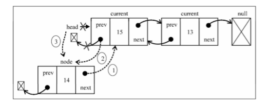

假如我们要在列表的最后一项添加一个新元素。这是一个特殊情况，因为我们还控制着指向最后最后一个元素的指针（tail）。current变量将引用最后一个元素。然后开始建立第一个链接：node.prev将引用current。current.next指针将指向node（由于构造函数，node.next已经指向了null），最后一件事就是更新tail，它将由指向current变为指向node。

如图：

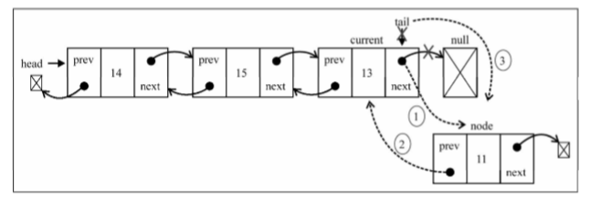

第三种情况是：在列表中间插入一个元素。就像之前的方法中，迭代列表，直到到达要找的位置。我们将在current和previous元素之间插入新元素。首先，node.next将指向current，而previous.next将指向node，这样就不会丢失节点之间的链接。然后要处理所有的链接：current.prev将指向node，而node.prev将指向previous。

如图：

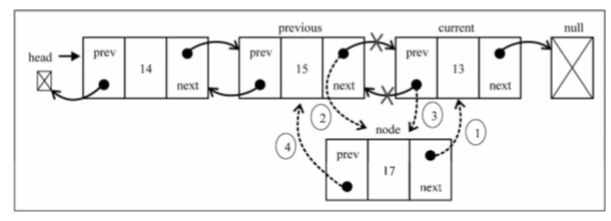

我们可以改进insert和remove两个方法。如果position大于length / 2，最好从尾部开始迭代，性能改进

**从任意位置移除元素**

从双向链表中移除元素跟链表相似。唯一的区别是还要设置前一个位置的指针

	this.removeAt = function( position ) {

		if ( position > -1 && position < length ) {

			var current = head,
			
				previous,

				index = 0;

			if ( position === 0 ) {

				head = current.next;

				if ( length === 1 ) {

					tail = null;

				} else {

					head.prev = null;
		
				}
			} else if ( position === length-1 ) {

				current = tail;

				tail = current.prev;

				tail.next = null;

			} else {

				while ( index++ < position ) {

					previous = current;

					current = current.next;
				}

				previous.next = current.next;
	
				current.next.prev = previous;

			}

			length--;

			return current.element;

		} else {

			return null;
		}

	};

我们要处理三种情况：从头部、中间和尾部移除元素。

第一种：current变量是对列表中第一个元素的引用，也就是我们想要移除的元素。需要做的是改变head的引用，将current改为下一个元素（current.next)。但我们还要更新current.next指向上一个元素的指针（因为第一个元素的prev指针是null）。因此，把head.prev的引用改为null(因为head也只想列表中新的第一个元素，或者也可以用current.next.prev).由于还需要控制tail的引用，我们可以检查要移除的元素是否是第一个元素，如果是，只需要把tail设为null。

如图：

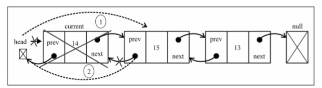

第二种：既然已经有了对最后一个元素的引用（tail），我们就不需要为找到他而进行迭代列表。这样我们也就可以把tail的引用赋给current变量。接下来，需要把tail的引用更新为列表中倒数第二个额元素（current.prev，或tail.prev）。既然tail指向了倒数第二个元素，我们就只需要把next指针更新为null（tail.next=null)

如图：

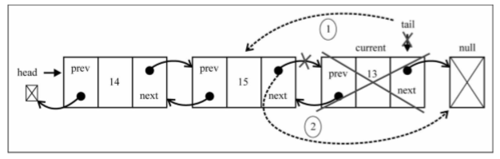

第三种：首先迭代列表，直到达到要找的位置。current变量所引用的就是要移除的元素。那么要移除他，我们就可以通过更新previous.next和current.next.prev的引用，在列表中跳过他。因此，previous.next将指向current.next，而current.next.prev将指向previous

如图：

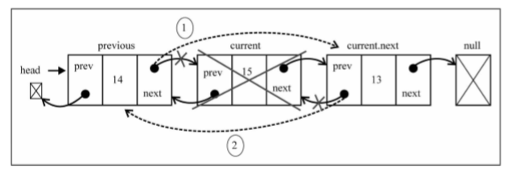

**循环列表**

循环列表可以向链表一样只有单项引用，也可以向双向链表一样有双向引用，循环链表和链表之间的唯一区别是，最后一个元素指向下一个元素的指针（tail.next)不是null，而是指向了第一个元素（head），如图

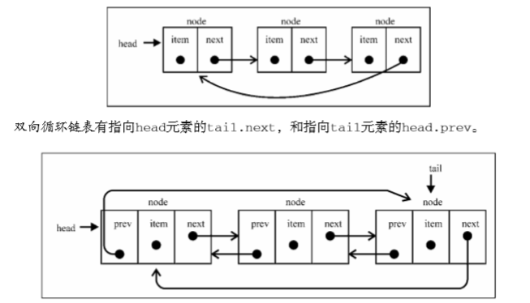

### 集合 ###

数组（列表）、栈、队列和链表是顺序数据结构，这章就看看集合这种数据结构

集合是由一组无序且唯一（不能重复）的项组成。这个数据结构使用了有限集合的数学概念。学习中我们要知道数学中的集合的相关特性，如空集、表示方式，以及操作（交集、并集、差集）。

**创建一个集合**

这章我们的学习要以Set类为基础了，Set类是ECMAScript6的。Set类的骨架是：

	function Set() {

		var items = {};
	}

我们用对象而不是数组来实现集合，下面看看声明一些集合可用的方法

	add(value):向集合中添加一个新的项

	remove(value):从集合中移除一个值

	has(value):如果集合中有这个值，返回true，否则返回false

	clear():移除集合中的所有项

	size():返回集合中包含元素的数量，与数组的length类似

	values():返回一个包含集合中所有值的数组

**has(value)方法**

因为这个方法会被add、remove方法调用就先实现这个方法

	this.has = function(value) {
		
		return value in items;
	}

我们用对象来存储集合的值，可以用JS的in操作符来验证给定的值是否是items对象的属性

更好的实现方法如下：

	this.has = function(value) {
		
		return items.hasOwnProperty(value);
	}

所有JS对象都有hasOwnProperty方法，这个方法返回一个表明对象是否具有特定属性的布尔值

**add方法**

	this.add = function(value) {
		
		if (!this.has(value)) {

			items[value] = value;
			return true;
		}

		return false;
	}

对于给定的value，可以检查它是否存在集合中。如果不存在，就把value添加到集合中，返回true，表示添加了这个值。如果已经有了这个值，返回false，表示没有添加它

**remove和clear方法**

	this.remove = function(value) {

		if ( this.has(value) ) {

			delete items[value];
		
			return true;
		}
		
		return false;
	};

在remove方法中，我们会验证给定的value是否存在于集合中，存在就从集合中移除value，并返回true，表示值被移除；否则返回false

既然用对象来存储集合中的items对象，就可以简单地使用delete操作符从items对象移除属性

使用Set类的示例

	var set = new Set();

	set.add(1);

	set.add(2);

执行之后打印出来会是Object { 1: 1, 2: 2 },
可以看到，这是一个有两个属性的对象。属性名就是添加到集合的值，同时也是属性值

要移除集合中所有值，可以用clear方法

	this.clear = function() {

		items = {};
	}

要重置items对象，需要做的是把一个空对象重新赋值给它。也可以迭代集合，用remove方法依次移除所有值

**size方法**

三种实现方法

第一种用length变量，每当使用add或remove时控制它，就像上一章使用LinkedList类一样

第二种，使用JS内建的Object类的一个内建函数

	this.size = function() {

		return Object.keys(items).length;
	};

JS的Object类有一个keys方法，它返回一个包含给定对象所有属性的数组。在这种情况下，可以使用这个数组的length属性来返回items对象的属性个数。

第三种手动提取items对象的每个属性，记录属性的个数并返回这个数字。这个方法可以在任何浏览器运行，并与之前的代码等价

	this.sizeLegacy = function() {

		var count = 0;
		
		for ( var prop in items ) {

			if ( items.hasOwnProperty(prop) ) {

				++count;
			}
		};
		
		return count;
	};

遍历items对象的所有属性，检查它们是否是对象自身的属性。如果是，就递增count变量的值，最后在结束的时候返回这个数字

不能简单的使用for-in语句遍历items对象的属性，递增count变量的值，还要用has方法验证items对象是否具有该属性，因为对象的原型包含了额外的属性（属性既有继承自JS的Object类的，也有属于对象自身，未用于数据结构的）。

**values方法**

values方法用了相同的逻辑，提取items对象的所有属性，以数组形式返回：

	this.values = function() {

		return Object.keys(items);
	};

以上代码是受浏览器版本的限制的，通用的版本如下：

	this.valuesLegacy = function() {

		var keys = [];

		for ( var key in items ) {

			keys.push(key);
		}

		return keys;
	};

遍历items对象的所有属性，把它们添加到一个数组中，并返回这个数组

**使用Set类**

现在数据结构已经完成，开始使用

	var set = new Set();

	set.add(1);

	console.log(set.values());

	console.log(set.has(1));

	console.log(set.size());

	set.add(2);

	console.log(set.values());

	console.log(set.has(2));

	console.log(set.size());

	set.remove(1);

	console.log(set.values());

	set.remove(2);

	console.log(set.values());

现在我们有了一个和ES6很相似的Set类，也可以用数组代替对象，存储元素

#### 集合操作 ####

并集：给定的两个集合，返回一个包含两个集合所有元素的新集合

交集：给定的两个集合，返回一个包含两个集合共有元素的新集合

差集：对于给定的两个集合，返回一个包含所有存在于第一个集合而不存在于第二个集合的元素的新集合

子集：验证一个给定集合是否是另一个集合的子集

**并集**

至于数学表达的形式和方式不在赘述，直接看代码，来实现Set类的union方法

	this.union = function(otherSet) {

		var unionSet = new Set();

		var values = this.values();

		for ( var i = 0; i < values.length; i++ ) {

			unionSet.add(values[i]);

		}

		values = otherSet.values();

		for ( var i = 0; i < values.length; i++ ) {

			unionSet.add(values[i]);
		}

		return unionSet;
	};

测试代码

	var setA = new Set();

	setA,add(1);

	setA.add(2);

	setA.add(3);

	var setB = new Set();

	setB.add(3);

	setB.add(4);

	setB.add(5);

	setB.add(6);

	var unionAB = setA.union(setB);

	console.log(unionAB.values());

输出为["1", "2", "3", "4", "5", "6"]。元素3在A和B中都存在，它在集合中只出现一次。

**交集**

	this.intersection = function(otherSet) {
		
		var intersectionSet = new Set();

		var values = this.values();

		for ( var i = 0; i < values.length; i++ ) {

			if ( otherSet.has( values[i] ) ) {

				intersectionSet.add( values[i] );
			}
		}

		return intersectionSet;
	}

intersection方法需要找到当前Set实例中，所有也存在于给定Set实例中的元素。首先创建一个新的Set实例，这样就能用它返回共有的元素。接下来，遍历当前Set实例所有的值，验证它们是否也存在于otherSet实例。可以用这一章前面实现的has方法来验证元素是否存在于Set实例中。然后，如果这个值也存在于另一个Set实例中，就将其添加到创建的intersectionSet变量中，最后返回它

测试

	var setA = new Set();

	setA.add(1);

	setA.add(2);

	setA.add(3);

	var setB = new Set();

	setB.add(2);

	setB.add(3);

	setB.add(4);

	var intersectionAB = setA.intersection(setB);

	console.log(intersectionAB.values());

输出["2", "3"]

**差集**

两个集合AB，差集表示A-B，A中没有和B相同的元素

	this.difference = function(otherSet) {
		
		var differenceSet = new Set();

		var values = this.values();

		for ( var i = 0; i < values.length; i++ ) {

			if ( !otherSet.has( values[i] ) ) {

				differenceSet.add( values[i] );
			} 
		}

		return differenceSet;
	};

intersection方法会得到所有同时存在于两个集合的值。而difference方法会得到所有存在于集合A但不存在于B的值。因此这两个方法在实现上唯一的区别是行。只获取不存在于otherSet实例中的值，而不是也存在于其中的值

测试

	var setA = new Set();

	setA.add(1);

	setA.add(2);

	setA.add(3);

	var setB = new Set();

	setB.add(2);

	setB.add(3);

	setB.add(4);

	var differenceAB = setA.difference(setB);

	console.log( differenceAB.values() );

**子集**

集合A是B的子集

	this.subset = function( otherSet ) {

		if ( this.size() > otherSet.size() ) {

			return false;
		} else {

			var values = this.values();
			
			for ( var i = 0; i < values.length; i++ ) {

				if ( !otherSet.has( values[i] ) ) {

					return false;
				}
			}
			
			return true;
			}
	};

首先要验证当前Set实例的大小，如果当前实例中的元素比otherSet实例更多，它就不是一个子集。子集的元素个数需要小于或等于要比较的集合

接下来要遍历集合中的所有元素，验证这些元素也存在于otherSet中，如果任何元素不存在于otherSet中，就意味着它不是一个子集，返回false。如果所有元素都存在于otherSet中，行就不会被执行，那么就返回true

测试

	var setA = new Set();

	setA.add(1);

	setA.add(2);

	var SetB = new Set();

	setB.add(1);

	setB.add(2);

	setB.add(3);

	var setC = new Set();

	setC.add(2);

	setC.add(3);

	setC.add(4);

	console.log( setA.subset(setB) );

	console.log( setA.subset(setC) );

我们有3个集合：setA是setB的子集，因此输出true，然而setA不是setC的子集，因此输出false

### 字典和散列 ###

字典和散列表是用来存储唯一值（不重复的值）的数据结构。集合、字典和散列表可以存储不重复的值。集合中的重点是每个值本身，并作为主要元素。字典中我们用[键, 值]的形式来存储数据。散列表中也是一样。不同的地方我们后续说。

**字典**

字典中，存储的是[键, 值]对，其中键名是用来查询特定元素的。字典和集合很相似，集合以[值, 值]得形式来存储元素，字典则是以[键, 值]的形式来存储元素。字典有时也称作映射。

**创作一个字典**

与Set类类似，ES6同样包含了一个Map类的实现，即我们说的字典

Dictionary类的骨架：

	function Dictionary() {

		var items = {};
	}

与Set类类似，我们将在一个Object的实例而不是数组中存储元素，声明的方法有

	set(key, value):向字典中添加新元素

	remove(key):通过使用键值来从字典中移除键值对应的数据值

	has(key):如果某个键值存在于这个字典中，则返回true，反之返回false

	get(key):通过键值查找特定的数值并返回

	clear():将这个字典中的所有元素全部删除

	size():返回字典中所有元素的数据量，类似于数组的length属性

	keys():将字典中所包含的所有键名以数组形式返回

	values():将字典中所包含的所有数值以数组形式返回

**1.has和set方法**

	this.has = function(key) {

		return key in items;

	};

与实现Set类一样，我们使用JS的in操作符来验证一个key是否是items对象的一个属性，set方法的实现

	this.set = function(key, value) {

		items[key] = value;
	};

该方法接受一个key和一个value作为参数。我们将value设为items对象的key属性的值，它可以用来给字典添加一个新的值，或用来更新一个已有的值

**2.remove方法**

与Set类不同的是我们将先搜索key不是value

	this.remove = function(key) {

		if ( this.has(key) ) {

			delete items[key];
			return true;
		}
		return false;
	};

然后我们可以用JS的remove操作符从items对象中移除key属性

**get和values方法**

如果我们想在字典中查找一个特定的项，并检索它的值，方法如下

	this.get = function(key) {

		return this.has(key) ? items[key] : undfined;
	};
get方法首先会验证我们想要检索的值是否存在（通过检查key值），如果存在将返回该值，反之将返回一个undefined值。

values方法。以数组的形式返回字典中所有values实例的值

	this.values  = function() {

		var values = {};

		for ( var k in items ) {

			if ( this.has(k) ) {

				values.push(items[k]);
			}
		}
		
		return values;
	};

首先，我们遍历items对象的所有属性值，为确定值存在，我们使用has函数来验证key确实存在，然后将它的值加入values数组。最后，我们就能返回所有找到的值。

**clear、size、keys和getItems方法**

clear、size和keys这些方法和Set类是完全一样的，最后我们验证items属性输出的值。我们可以实现一个返回items变量的方法，叫做getItems

	this.getItems = function() {

		return items;
	}

**使用Dictionary类**

首先我们创建一个Dictionary类的实例，然后给它添加三条电子邮件地址。我们将会使用这个dictionary实例来实现一个电子邮件地址簿

	var dictionary = new Dictionary();

	dictionary.set('Gandary', 'gandary@email.com');

	dictionary.set('John', 'john@email.com');

	dictionary.set('Tyrion', 'tyrion@email.com');

执行下面的结果返回true

	console.log(dictionary.has('Gandary'));

下面的代码将输出3，因为我们添加了3个元素

	console.log(dictionary.size());

执行如下代码

	console.log(dictionary.keys());

	console.log(dictionary.values()):

	conaole.log(dictionary.get('Tyrion'));

输出的结果

	["Gandary", "John", "Tyrion"]
	
	["gandary@email.com", "john@email.com", "tyrion@email.com"]

	tyrion@email.com

最后执行

	dictionary.remove('John');

	console.log(dictionary.keys());

	console.log(dictionary.values());

	console.log(dictionary.getItems());

输出结果

	["Gandary", "Tyrion"]
	
	["gandary@email.com", "tyrion@email.com"]

	Object {Gandary:"gandary@email.com", Tyrion: "tyrion@email.com"}

移除了一个元素，现在的dictionary实例只包含了两个元素。最下面的表现了items对象的内部结构

**散列表**

首先会看到HashTable类，也叫做HashMap类，是Dictionary类的一种散列表表现方式

散列算法的作用是尽可能快的在数据结构中找到一个值，之前的章节中你已经知道如果要在数据结构中获得一个值（使用get方法），需要遍历整个数据结构来找到它。如果使用散列函数，就知道值的具体位置，因此能够快速检索到该值。散列函数的作用是给定一个键值，然后返回该值在表中的地址。

举个例子，我们使用在前一节中使用的电子邮件地址簿。我们将要使用最常见的散列函数---“lose lose”散列函数，方法是简单地将每个键值中的每个字母的ASCII值相加。

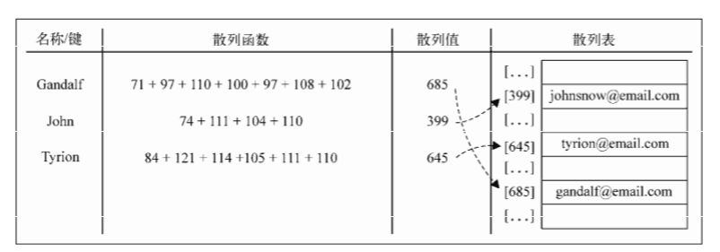

**创建一个散列表**

我们将使用数组来表示我们的数据结构，该数据结构和上个话题中的图表所用的非常相似

骨架

	function HashTable() {

		var table = [];
	}

然后添加方法，我们给每个类实现三个基础方法

	put(key, value):项散列表添加一个新的项（也能更新散列表）

	remove(key):根据键值从散列表中移除值

	get(key):返回根据键值检索到的特定的值

实现这些方法之前我们首先要实现第一个方法是散列函数，它是HashTable类中的一个私有方法

	var loseloseHashCode = function(key) {

		var hash = 0;

		for ( var i = 0; i < key.length; i++ ) {

			hash += key.charCodeAt(i);
		}

		return hash % 37;
	};

给定一个key参数，我们就能根据组成key的每个字符的ASCII码值得和得到一个数字。所以，首先需要一个变量来存储这个总和。然后，遍历keybingjiangcongASCII表中查到的每个字符对应的ASCII值加到hash变量中（可以使用JS的String类中的charCodeAt方法）。最后，返回hash值。为了得到比较小的数值，我们会使用hash值得一个任意数做除法的余数（mod）。

有了散列函数，我们就实现put方法

	this.put = function(key, value) {

		var position = loseloseHashCode(key);

		console.log(position + '-' + key);

		table[position] = value;
	};

首先，根据给定的key，我们需要根据所创建的散列函数计算出它在表中的位置。为了便于展示信息，我们将计算出的位置输出至控制台。由于它不是必须的，我们也可以将这行代码移除。然后要做的，是将value参数添加到用散列函数计算的对应的位置上。

从HashTable实例中查找一个值也很简单，为此我们实现一个get方法

	this.get = function( key ) {

		return table[loseloseHashCode(key)];
	};

首先，我们会使用所创建的散列函数来求出给定key所对应的位置。这个函数会返回值得位置，因此我们所要做的就是根据这个位置从数组table中获得这个值

我们要实现的最后一个方法是remove方法

	this.remove = function(key) {

		table[loseloseHashCode(key)] = undefined;
	};

要从HashTable实例中移除一个元素，只需要求出元素的位置（可以用散列函数来获取）并赋值为unfined

对于HashTable类来说，我们不需要像ArrayList类一样从table数组中将位置也移除。由于元素分布于整个数组范围内，一些位置会没有任何元素占据，并默认为unfined值。我们也不能将位置本身从数组中移除（这回改变其他元素的位置），否则，当下次需要获得或移除一个元素的时候，这个元素会不在我们用散列函数求出的位置上。

**使用HashTable类**

测试HashTable类

	var hash = new HashTable();

	hash.put('Gandalf', 'gandalf@email.com');

	hash.put('John', 'john@email.com');

	hash.put('Tyrion', 'tyrion@email.com');

执行结果

	19 - Gandalf

	29 - John

	16 - Tyrion

下图的图表展现了包含这三个元素的HashTable数据结构

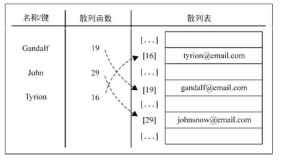

测试get方法

	console.log(hash.get('Gandalf'));

	console.log(has.get('Loiane'));

输出结果

	gandalf@email.com

	undefined
由于Gandalf是一个在散列表中存在的键，get方法将会返回它的值。由于Loiane是一个不存在的键，当我们试图在数组中根据位置来获取值得时候（一个有散列表生成的位置），返回值将会是unfined（即不存在）。

然后，我们试图从散列表中移除Gandalf

	hash.remove('Gandalf');

	console.log(hash.get('Gandalf'));

由于Gandalf不再存在于表中，hash.get('Gandalf')方法将会在控制台上给出undefined的输出结果

**散列表和散列集合**

散列表和散列映射是一样的，在一些编程语言中，还有一种叫做散列集合的实现。散列集合是由一个集合构成，但是插入、移除或获取元素时，使用的散列函数。我们可以使用本章节中实现的所有代码来实现散列集合，不同之处是，不再添加键值对，而是只插入值而没有键。例如，可以使用散列集合来存储所有的英语单词（不包括它们的定义）。和集合相似，散列集合只存储唯一的不重复的值。

**处理散列表中的冲突**

有时候，一些键会有相同的散列值。不同的值在散列表中对应相同的位置的时候，我们称之为冲突，例如下面代码的结果

	var hash = new HashTable();

	hash.put('Gandalf', 'gandalf@email.com');

	hash.put('John', 'johnsnow@email.com');

	hash.put('Tyrion', 'tyrion@email.com');

	hash.put('Aaron', 'aaron@email.com');

	hash.put('Dnnie', 'donnie@email.com');

	hash.put('Ana', 'ana@email.com');

	hash.put('Jonathan', 'jonathan@email.com');

	hash.put('Jamie', 'jamie@email.com');

	hash.put('Sue', 'sue@email.com');

	hash.put('Mindy', 'mindy@email.com');

	hash.put('Paul', 'paul@email.com');

	hash.put('Nathan', 'nathan@email.com');	

输出结果

	19 - Gandalf

	29 - John

	16 - Tyrion

	16 - Aaron

	13 - Dnnie

	13 - Ana

	5 - Jonathan

	5 - Jamie

	5 - Sue

	32 - Mindy

	32 - Paul

	10 - Nathan	
注意，Tyrion和Aaron有相同的散列值。还有几个也是

那HashTable实例会怎样呢？执行之前的代码后散列表会有哪些值呢？

我们用个print方法，在控制台上输出HashTable中的值

	this.print = function() {
	
		for ( var i = 0; i < table.length; ++i ) {

			if ( table[i] !== undefined ) {

				console.log(i + ":" + table[i]);
			}
		}

	};

首先，遍历数组中的所有元素，当某个位置上有值得时候，会在控制台输出位置和对应的值

	hash.print();
	
	5:sue@email.com
	
	10:nathan@email.com

	13:ana@email.com

	16:aaron@email.com

	19:gandalf@email.com

	29:johnsnow@email.com

	32:paul@email.com

Johnathan、Jamie和Sue有相同的散列值，也就是5，由于Sue是最后一个被添加的，Sue将是在HashTable实例中占据位置5的元素，。首先，Johnathan会占据这个位置，然后Jamie会覆盖它，然后Sue会再次覆盖。其他冲突的元素也是一样的原因

使用一个数据结构来保存数据的目的显然不是去丢失数据，而是通过某种方法将它们全部保存起来，因此，这种情况发生时，我们也有解决方案：分离链接、线性探查和双散列，我们说前两种。

**1.分离链接**

分离链接方法包括为散列表的每一个位置创建一个链表并将元素存储在里面。它是解决冲突的最简单的方法，但在HashTable实例之外还需要额外的存储空间。

例如，我们在之前的测试代码中使用分离链接的话，输出的结果如下图

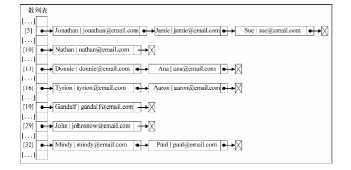

在位置5上，将会包含3个元素的LinkedList实例；在位置13、16和32上，将会有包含两个元素的LinkedList实例；在位置10、19和29上，将会有包含单个元素的LinkedList实例。

对于实现一个使用了分离链接的HashTable实例，我们需要一个新的辅助类来表示将要加入LinkedList实例的元素。我们管它叫做ValuePair类（在HashTable类内部定义）

	var ValuePair = function(key, value) {

		this.key = key;

		this.value = value;

		this.toString = function() {

			return '[' + this.key + '-' + this.value + ']';
		}
	};

这个类只会将key和value存储在一个Object实例中。我们也重写了toString方法，以便之后在浏览器控制台输出结果。

**put方法**

我们实现第一个方法，put方法

	this.put = function(key, value) {

		var position = loseloseHashCode(key);
		
		if ( table[position] == undefined ) {

			table[position] = new LinkedList();
		}

		table[position].append( new ValuePair(key, value) );
	};

这个方法，将验证要加入的新元素的位置是否已经被占据。如果这个位置是第一次被加入元素，我们将会在这个位置上初始化一个LinkedList类的实例。然后，使用append方法向LinkedList实例添加一个ValuePair实例。

**get方法**

然后，我们实现用来获取特定值得get方法

	this.get = function(key) {

		var position = loseloseHashCode(key);

		if (table[position] !== undefined) {

			var current = table[position].getHead();

			while(current.next) {

				if ( current.element.key === key ) {

					return current.element.value;
			
				}
	
				current = current.next;

			}

			if ( current.element.key === key ) {

				return current.element.value;
			}
		}

		return undefined;
	};

我们要做的第一个验证，是确定在特定的位置上是否有元素存在，如果没有，则返回一个undefined表示HashTable实例中没有找到这个值。如果在这个位置上有值存在，我们知道这是一个LinkedList实例。现在要做的是遍历这个链表来寻找我们需要的元素。在遍历之前先要获取链表表头的引用，然后就可以从链表的头部遍历到尾部（current.next将会是null）。

Node链表包含next指针和element属性。而element属性又是ValuePair的实例，所以它又有value和key属性。可以通过current.element.next来获取Node链表的key属性，并通过比较它来确定它是否就是我们要找的键。（这就是要使用ValuePair这个辅助来来存储元素的原因，我们不能简单地存储值本身，这样就不能确定哪个值对应着特定的键。）如果key值相同，就返回Node的值；如果不相同，就继续遍历链表，访问下一个节点。

如果要找的元素是链表的第一个或最后一个节点，那么就不会进入while循环的内部。因此，需要在行处理这种特殊的情况。

**remove方法**

使用分离链表方法从HashTable实例中移除一个元素和之前在本章实现的remove方法有一些不同。现在使用的是链表，我们需要从链表中移除一个元素。

	this.remove = function(key) {

		var position = loseloseHashCode(key);

		if ( table[position] !== undefined ) {

			var current = table[position].getHead();

			while(current.next) {

				if ( current.element.key === key ) {

					table[position].remove(current.element);
		
					if ( table[position].isEmpty() ) {

						table[position] = undefined;
					}
				
					return true;

				}

				current = current.next;
			}

			if (current.element.key === key) {

				table[position].remove(current.element);

				if ( table[position].isEmpty() ) {

					table[position] = undefined;

				}
	
				return true;

			}
		}

		return false;
	};

在使用remove方法中，我们使用和get方法一样的步骤找到要找的元素。遍历LinkedList实例时，如果链表中的current元素就是要找的元素，使用remove方法将其从链表中移除。然后进行一步额外的验证：如果链表为空，就将散列表这个位置的值设为undefined。这样搜索一个元素或打印它的内容的时候，就可以跳过这位置。最后，返回true表示这个元素已经被移除或在最后返回false表示这个元素在散列表中不存在。同样，需要和get方法一样，处理元素在第一个或最后一个的情况。

重写了这三个方法，我们就拥有了一个使用了分离链表方法来处理冲突的HashMap实例。

**2.线性探查**

另一种解决冲突的方法是线性探查。当向表中某个位置加入一个新元素的时候，如果索引为index的位置已经被占据了，就尝试index+1的位置。如果index+1的位置也被占据了，就尝试index+2的位置，以此类推。

**put方法**

	this.put = function(key,value) {

		var position = loseloseHasCode(key);

		if ( table[position] == undefined ) {

			table[position] = new ValuePair(key, value);

		} else {

			var index = ++position;

			while( table[index] != undefined ) {

				index++;

			}

			table[index] = new ValuePair(key, value);
		}
	};

和之前一样，先获得由散列函数生成的位置，然后验证这个位置是否有元素存在（如果这个位置被占据了，将会通过行的验证）。如果没有元素存在，就在这个位置加入新元素。

如果这个位置已经被占据了，需要找到下一个没有被占据的位置（position的值是undefined），因此我们声明一个index变量并赋值为position+1（在变量名使用自增运算符++会先递增变量然后再将其赋值给index）。然后验证这个位置是否被占据，如果被占据了，继续将index递增，直到找到一个没有被占据的位置。然后要做的，就是将值分配到这个位置。

执行之后的结果，如下图：

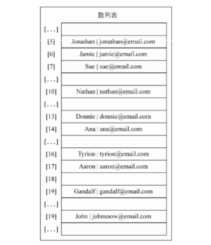

模拟一下散列表中的插入操作

①试着插入Gandalf。它的散列值是19，由于散列表刚刚被创建，位置19还是空的--可以在这里插入数据。

②试着在位置29插入John。它也是空的，所以可以插入这个姓名

③试着在位置16插入Tyrion，它也是空的，所以可以插入这个姓名

④试着插入Aaron，它的散列值也是16.位置16已经被Tyrion占据了，所以需要检查索引值为position+1的位置（16+1）。位置17是空的，所以可以在位置17插入Aaron

⑤接着，试着在位置13插入Donnie。它也是空的，所以可以插入

⑥想在位置13插入Ana，但是这个位置被占据了。因此在位置14进行尝试，它是空的，所以可以在这里插入姓名

⑦然后，在位置5插入Jonathan，这个位置是空的，所以可以插入

⑧试着在位置5插入Jamie，但是这个位置被占据了。所以调至位置6，这个位置也是空的，因此可以插入

⑨试着在位置5插入Sue，但是位置被占据了，跳至位置6也被占据了这个位置，接着跳至位置7，这里是空的，所以可以在这里插入姓名

以此类推

**get方法**

	this.get = function(key) {

		var position = loseloseHashCode(key);

		if ( table[position] !== undefined ) {

			if ( table[position].key === key ) {

				return table[position].value;
			} else {

				var index = ++position;

				while( table[index] === undefined || table[index].key !== key ) {

					index++;
			
				}

				if ( table[index].key === key ) {

					return table[index].value;

				}
			}
		}

		return undefined;

	};

要获得一个键对应的值，先要确定这个键存在，如果不存在说明要查找的值不在散列表中，因此可以返回undefined。如果这个键存在，需要检查我们要找的值是否就是这个位置上的值。如果是就返回这个值。

如果不是，就在散列表中的下一个位置继续查找，直到找到一个键值与我们要找的键值相同的元素。然后，验证一下当前项就是我们要找的项，并且将他的值返回。

我们无法确定要找的元素实际上在哪个位置上，这就是使用ValuePair来表示HashTable元素的原因

**remove方法**

remove方法和get方法基本相同，不同之处在于行，他们将会由下面的代码代替：

	table[index] = undefined;

要移除一个元素，只需要给其赋值为undefined，来表示这个位置不再被占据并且可以在必要时接受一个新元素。

**创建更好的散列函数**

我们实现的“loselose”散列函数并不是一个表现良好的散列函数，因为会长生太多的冲突，如果我们使用这个函数的话，会产生各种各样的冲突。一个表现良好的散列函数是有几个方面构成：插入和检索元素的时间（性能），当然也包括较低的冲突可能性。下面是个推荐，比loselose更好

	var djb2HashCode = function(key) {

		var hash = 5381;

		for ( var i = 0; i < key.length; i++ ) {

			hash = hash * 33 + key.charCodeAt(i);

		}

		return hash % 1013;
	};

它包括初始化一个hash变量并赋值为一个质数（大多数实现使用5318）。然后迭代参数key，将hash与33相乘（用来作为一个魔力数），并和当前迭代到的字符的ASCII码值相加。

最后，我们将使用相加的和与另一个随机质数（比我们认为的散列值的大小要大）相除的余数。

如果再次执行代码，下面是结果：

	798 - Gandalf

	838 - John

	624 - Tyrion

	215 - Aaron

	278 - Donnie

	925 - Ana

	288 - Johnthan

	962 - Jamie

	502 - Sue

	804 - Mindy

	54 - Paul

	223 - Nathan

没有冲突，这不是最优的散列函数，但是最被推荐的散列函数

### 树 ###

到目前为止，我们介绍了一些顺序数据结构，介绍的第一个非顺序数据结构是散列表。这章我们学习另一种非顺序数据结构--树，它对于存储需要快速查找的数据非常有用。

树是一种分层数据的抽象模型。现实生活中最常见的树的例子是家谱，或是公司的组织结构图，如图：

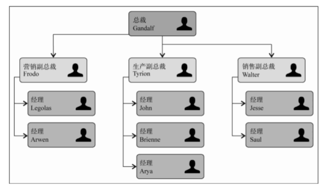

**相关术语**

一个树结构包含一系列存在父子关系的节点。每个节点都有一个父节点（除了顶部的第一个节点）以及零个或多个子节点。

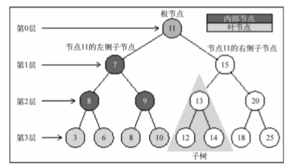

位于树顶部的节点叫做根节点（11）。它没有父节点。树中的每个元素都叫做节点，节点分内部节点和外部节点。至少有一个子节点的节点成为内部节点（7、5、9、15、13和20是内部节点）。没有子元素的节点称为外部节点或叶节点（3、6、8、10、12、14、18和25是叶节点）。

一个节点可以有祖先和后代。一个节点（除了根节点）的祖先包括父节点、祖父节点、曾祖父节点等。一个节点的后代包括子节点、孙子节点、曾孙节点等。例如，节点5的祖先有节点7和节点11，后代有节点3和节点6。

有关树的另一术语是子树。子树由节点和它的后代构成。例如，节点13、12和14构成了上图中树的一颗子树。

节点的一个属性是深度，节点的深度取决于它的祖先节点的数量。比如，节点3有3个祖先节点（5、7和11），它的深度为3。

树的高度取决于所有节点深度的最大值。一棵树也可以被分解成层级。根节点在第0层，它的子节点在第一层，以此类推。上图中的树的高度为（最大高度已在图中表示--第3层）。

**二叉树和二叉搜索树**

二叉树中的节点最多只能有两个子节点：一个是左侧子节点，另一个是右侧子节点。这些定义有助于我们写出更高效的向/从树种插入、查找和删除节点的算法。二叉树在计算机科学中的应用广泛。

二叉搜索树（BST）是二叉树的一种，但是它只允许你在左侧节点存储（比父节点）小的值，在右侧节点存储（比父节点）大（或等于）的值。上一节的图中就展现了一棵二叉搜索树。

二叉搜索树是我们要研究的数据结构。

**创建BinarySearchTree类**

让我们开始创建自己的BinarySearchTree类，我们它的结构

	function BinarySearchTree() {

		var Node = function(key) {

			this.key = key;

			this.left = null;

			this.right = null;

		};

		var root = null;

	}

下图展现了二叉搜索树数据结构的组织方式

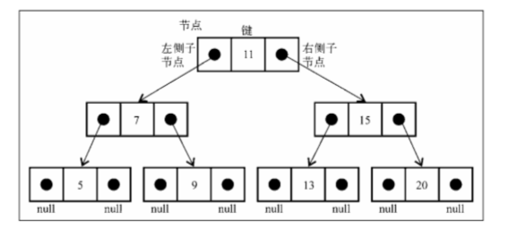

和链表一样，将通过指针来表示节点之间的关系（术语称其为边）。在双向链表中，每个节点包含两个指针，一个指向下一个节点，另一个指向上一个节点。对于树，使用同样的方式（也是使用两个指针）。但是一个指向左侧节点，另一个指向右侧节点。因此，将声明一个Node类来表示树中的每个节点。值得注意的一个小细节是，不同于之前的章节将节点本身分为节点或项，我们将会称其为键。键是树相关的术语中对节点的称呼。

我们将会遵循和LinkedList类中相同的模式，这表示也将声明一个变量以控制此数据结构的第一个节点。在树中，它不再是头节点，而是根元素。

我们需要实现一些方法

	insert(key):向树中插入一个新的键

	search(key):在树中查找一个键，如果节点存在，则返回true；不存在返回false

	inOrderTraverse:通过中序遍历方式遍历所有节点

	preOrderTraverse:通过先序遍历方式遍历所有节点

	postOrderTraverse:通过后序遍历方式遍历所有节点

	min:返回树中最小的值/键

	max:返回树中最大的值/键

	remove(key):从树中移除某个值

**向树中插入一个键**

本章我们会用稍微复杂的方法，我们将会在方法中使用很多递归，下面的代码是用来向树插入一个新键的算法的第一部分：

	this.insert = function(key) {

		var newNode = new Node(key);

		if ( root === null ) {

			root = newNode;
		} else {

			insertNode(root, newNode);
		}
	};

要向树中插入一个新的节点或项，要经历三个步骤

第一步是创建用来表示新节点的Node类实例。只需要向构造函数传递我们想用来插入树的节点值，它的左指针和右指针的值会由构造函数自动设置为null。

第一步要验证这个插入操作是否为一种特殊情况。这个特殊情况就是我们要插入的节点是树的第一节点。如果是，就将根节点指向新节点。

第三步是将节点加在非根节点的其他位置。这种情况需要一个私有的辅助函数，函数定义如下

	var insertNode = function(node, newNode) {

		if ( newNode.key < node.key ) {

			if ( node.left === null ) {

				node.left = newNode;
			} else {

				insertNode( node.left, newNode );
			}
		} else {

			if ( node.right === null ) {

				node.right = newNode;
			} else {

					insertNode( node.right, newNode );
			
			}
		}
	};

insertNode函数会帮助我们找到新节点应该插入的正确位置，实现步骤如下

如果树非空，需要找到插入新节点的位置。因此，在调用insertNode方法时要通过参数传入树的根节点和要插入的节点。

如果新节点的键小于当前节点的键（现在，当前节点就是根节点），那么需要检查当前节点的左侧子节点。如果没有左侧子节点，就在那里插入新的节点。如果有左侧节点，需要通过递归调用insertNode方法继续找到树的下一层。在这里，下次将要比较的节点将会是当前节点的左侧子节点。

如果节点的键比当前节点的键大，同时当前节点没有右侧节点，就在那里插入新的节点。如果有右侧节点，同样需要递归调用insertNode方法，但是要用来和新节点比较的节点将会是右侧子节点。

用例子来理解过程：我们有一个新的树，并且想要它插入第一个值

	var tree = new BinarySearchTree();
	
	tree.insert(11);

这种情况下，树中有一个单独的节点，根指针将会指向它。源代码的行2将会执行。看看下面所示树结构的情况：

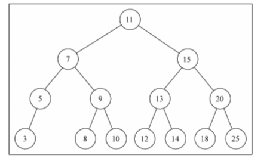

创建上图所示的树的代码如下，它们接着上面的代码

	tree.insert(7);

	tree.insert(15);

	tree.insert(5);

	tree.insert(3);

	tree.insert(9);

	tree.insert(8);

	tree.insert(10);

	tree.insert(13);

	tree.insert(12);

	tree.insert(14);

	tree.insert(20);

	tree.insert(18);

	tree.insert(25);

同时我们想要插入一个值为6的键，代码如下

	tree.insert(6);

下面的步骤将会被执行

（1）树不是空的，行3的代码会被执行。insertNode方法将会被调用(root, key[6])

（2）算法将会检测行4(key[6] < root[11]为真)，并继续检测执行行5(node.left[7]不是null),接着到达行7，调用insertNode(node.left[7], key[6])。

（3）将再次进入insertNode方法内部，但是使用了不同的参数。它会再次检测行4(key[6] < node[7]为真),然后再检测行5(node.left[5]不是null),接着到达行7，调用insertNode(node.left[5], key[6])。

（4）将再一次进入insertNode方法内部。它会再次检测行4(key[6] < node[5]为假),然后到达行8(node.right是null--节点5没有任何右侧的子节点),然后将会执行行9，在节点5的右侧子节点位置插入键6.

（5）然后，方法调用会依次出栈，代码执行过程结束

下图为插入键6后的结果

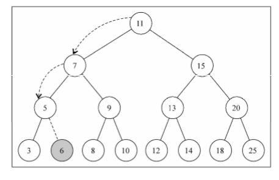

**树的遍历**

遍历一棵树是指访问树的每个节点并对它们进行某种操作的过程。但是我们应该怎么做，应该从树的顶端还是底端开始呢？从左边开始还是右边开始呢？访问树的所有节点有3中方式：中序、先序和后序

**中序遍历**

中序遍历是一种以上行顺序访问BST所有节点的遍历方式也就是以从最小到最大的顺序访问所有节点。中序遍历的一种应用就是对树进行排序操作。看实现方法：

	this.inOrderTraverse = function(callback) {

		inOrderTraverseNode(root, callback);
	};

inOrderTraverse方法接收一个回调函数作为参数。回调函数用来定义我们对遍历到的每个节点进行的操作（这也叫访问者模式），由于我们在BST中最常实现的算法是递归，这里使用了一个私有的辅助函数，来接收一个节点和对应的回调函数作为参数。

	var inOrderTraverseNode = function(node, callback) {

		if ( node !== null ) {

			inOrderTraverseNode(node.left, callback);

			callback(node.key);

			inOrderTraverseNode(node.right, callback);
		}
	};

要通过中序遍历的方法遍历一棵树，首先要检查以参数形式传入的节点是否为null（这就是停止递归继续执行的判断条件--行2--递归算法的基本条件）。

然后，递归调用相同的函数来访问左侧子节点。接着对这个节点进行一些操作（callback），然后再访问右侧子节点。

我们试着在之前展示的树上执行下面的方法

	function printNode(value) {

		console.log(value);
	}

	tree.inOrderTraverse(printNode);

但首先，需要创建一个回调函数。我们要做的，是在浏览器的控制台上输出节点的值。然后调用inOrderTraverse方法并将回调函数作为参数传入行7.执行后的结果是

3 5 6 7 8 9 10 11 12 13 14 15 18 20 25 

下图描绘了inOrderTraverse方法的访问路径：

**先序遍历**

先序遍历是以优先于后代节点的顺序访问每个节点的。先序遍历的一种应用是打印一个结构化的文档。

	this.preOrderTraverse = function( callback ) {

		preOrderTraverseNode( root, callback );
	};

preOrderTraverseNode方法的实现如下：

	var preOrderTraverseNode = function( node, callback ) {

		if ( node !== null ) {

			callback(node.key);

			preOrderTraverseNode(node.left, callback);

			preOrderTraverseNode(node.right, callback);
		}
	};

先序遍历和中序遍历不同点是，先序遍历会先访问节点本身，然后再访问它的左侧子节点，最后是右侧子节点，而中序遍历的执行顺序是行2、行2和行3

下面是控制台上输出的结果

11 7 5 3 6 9 8 10 15 13 12 14 20 18 25

下图描绘了preOrderTraverse方法的访问路径

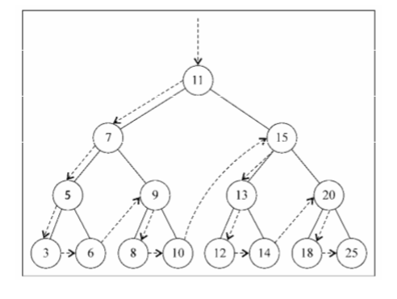

**后序遍历**

后序遍历则是先访问节点的后代节点，在访问节点本身。后序遍历的一种应用是计算机一个目录和它的子目录中所有文件所占空间的大小

	this.postOrderTraverse = function(callback) {

		postOrderTraverseNode(root, callback);
	};

	postOrderTraverseNode = function( node, callback ) {

		if ( node !== null ) {

			postOrderTraverseNode(node.left, callback);

			postOrderTraverseNode(node.right, callback);

			callback(node.key);
		}
	};

后序遍历先访问左侧子节点，然后是右侧子节点，最后是父节点本身

中序遍历、先序遍历和后序遍历唯一不同的是行1、行2和行3的执行顺序

下面是控制台输出的结果

3 6 5 8 10 9 7 12 14 13 18 25 20 15 11

下图描绘了postOrderTraverse方法的访问路径

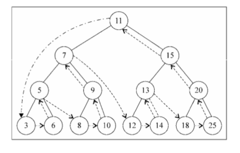

**搜索树中的值**

在树中，有三种经常执行的搜索类型：

最小值、最大值和搜索特定的值

**搜索最小值和最大值**

用这个树作为例子

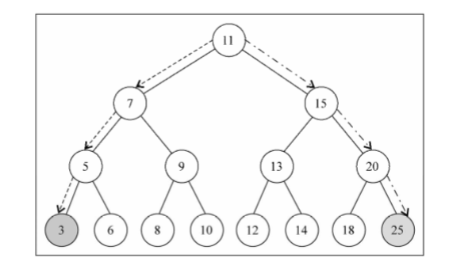

我们直接也能看到最大值和最小值，最左侧的节点就是这棵树中的最小的键，值为3，最右端的节点，是这棵树中最大的键，值为25

首先看看找寻树的最小键的方法

	this.min = function() {

		return minNode(root);
	};

	var minNode = function( node ) {

		if ( node ) {

			while ( node && node.left !== null ) {

				node = node.left;

			}

			return node.key;
		}

		return null;
	}; 

minNode方法允许我们从树中任意一个节点开始寻找最小的键。我们可以使用它来找到一个一棵树或它的子树中最小的键。因此，我们在调用minNode方法的时候传入树的根节点。因为我们想要找到整棵树的最小键。

在minNode内部，我们会遍历树的左边直到找到树的最下层（最左端）

以相似的方式可以实现max方法

	this.max = function() {

		return maxNode(root);
	};

	var maxNode = function( node ) {

		if ( node ) {

			while ( node && node.right !== null ) {

				node = node.right;

			}

			return node.key;

		}

		return null;

	};

我们找最大的键，我们要沿着树的右边进行遍历直到找到最右端的节点

因此，对于寻找最小值，总是沿着树的左边；对于寻找最大值，总是沿着树的右边

**搜索一个特定的值**

之前的章节，我们同样实现了find、search或get方法来查找数据结构中的一个特定的值。我们将同样在BST中实现搜索方法

	this.search = function( key ) {

		return searchNode( root, key );
	};

	var searchNode = function( node, key ) {

		if ( node === null ) {

			return false;
		}

		if ( key < node.key ) {

			return searchNode( node.left, key );
		} else if ( key> node.key ) {

			return searchNode( node.right, key );

		} else {

			return true;
		}
	};

我们要做的第一件事，是声明search方法。和BST中声明的其他方法的模式相同，我们将会使用一个辅助函数

searchNode方法可以用来寻找一棵树或他的任意子树中的一个特定值。这也是为什么在行1中调用它的时候传入树的根节点作为参数。

开始算法之前，先要验证作为参数传入的node是否合法（不是null）。如果是，说明要找的键没有找到，返回false

如果传入的节点不是null，需要继续验证。如果要找的键比当前的节点小，那么继续在左侧的子树上搜索。如果要找的键比当前的节点大，那么就从右侧子节点开始继续搜索，否则就说明要找的键和当前节点的键相等，就返回true来表示找到了这个键

可以用下面的代码来测试这个方法

	console.log( tree.search(1) ? 'Key 1 found.' : 'Key 1 not found.' );

	console.log( tree.search(8) ? 'Key 8 found.' : 'Key 8 not found.' );

输出结果为

	Value 1 not found.

	Value 8 found.

**移除一个节点**

我们要为BST实现下一个、也是最后一个方法remove方法。这是我们在本书中实现的最复杂的方法。我们先创建这个方法，使它能够在树的实现上被调用

	this.remove = function( key ) {

		root = removeNode( root, key );
	};

这个方法接收要移除的键并且它调用了removeNode方法，传入root和要移除的键作为参数。root被赋值为removeNode方法的返回值。原因稍后说。

removeNode方法的复杂之处在于我们要处理不同的运行场景，当然也包括它同样是通过递归来实现的。

看看removeNode方法的实现

	var removeNode = function( node, key ) {

		if ( node === null ) {

			return null;
		}

		if ( key < node.key ) {

			node.left = removeNode( node.left, key );
		
			return node;

		} else if ( key > node.key ) {
		
			node.right = removeNode( node.right, key );

			return node;
		} else {

			if ( node.left === null && node.right === null ) {

				node = null;

				return node;
			}

			if ( node.left === null ) {

				node = node.right;

				return node;

			} else if ( node.right === null ) {

				node = node.left;

				return node;

			}

			var aux = findMinNode( node.right );

			node.key = aux.key;

			node.right = removeNode( node.right, aux.key );

			return node;

		}
	};

我们看看行2，如果正在检测的节点是null，那么说明键不存在于树中，所以返回null

然后，第一件事，就是在树中找到移除的节点。因此，如果要找的键比当前节点的值小，就沿着树的左边找到下一个节点。如果要找的键比当前节点的值大，那么就沿着树的右边找到下一个节点

如果我们找到了要找的键（键和node.key相等），就需要处理三种不同的情况

**1.移除一个叶节点**

第一种情况是该节点是一个没有左侧或右侧子节点的叶节点，这个时候我们要做的就是给这个节点赋予null值来移除它。但是学习了链表的实现后，我们知道仅仅赋一个null值是不够的，还需要处理指针。在这里，这个节点没有任何子节点，但是它有一个父节点，需要通过返回null来将对应的父节点指针赋予null值。

现在节点的值已经是null了，父节点指向他的指针也会接收这个值，这也是我们要在函数中返回节点的值的原因。父节点总是会接收到函数的返回值。另一种可行的办法是将父节点和节点本身都作为参数传入方法内部。

如果回头来看代码的第一行，会发现我们在行4和行7更新了节点左右指针的值，同样也在行5和行8返回了更新后的节点

下图展现了移除一个叶节点的过程

**移除有一个左侧或右侧子节点的节点**

现在我们来看看第二种情况，移除有一个左侧子节点或右侧子节点的节点。这种情况下，需要跳过这个节点，直接将父节点指向他的指针指向子节点。

如果这个节点没有左侧子节点，也就是说它有一个右侧子节点。因此我们把对他的引用改为他右侧子节点的引用并返回更新后的节点。如果这个节点没有右侧子节点，也是一样--把对他的引用改为对他左侧子节点的引用并返回更新后的值。

下图展现了移除只有一个左侧子节点或右侧子节点的节点的过程

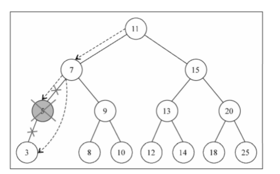

**移除有两个子节点的节点**

现在是第三种情况，就是要移除的节点有两个子节点--左侧子节点和右侧子节点。要移除它们需要走四步。

①、当找到了需要移除的节点后，需要找到他右边子树中最小的节点

②、然后，用它右侧子树中最小节点的键去更新这个节点的值。通过这一步，我们改变了这个节点的键，也就是说它beiyichule

③、但是，这样在树中就有两个拥有相同键的节点了，不可行。要继续把右侧子树中的最小节点移除，毕竟他已经被移至要移除的节点的位置了

④、最后，向他的父节点返回更新后节点的引用

findMinNode方法的实现和min方法的实现方式是一样的，唯一不同之处是，min方法中只返回键，而在findMinNode中返回了节点

下图展现了移除有两个子节点的节点的过程

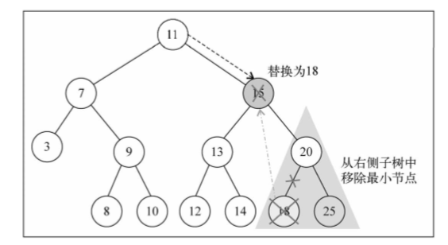

**更多关于二叉树的知识**

我们知道如何使用二叉搜索树，可以的话，可以继续学习更多的关于树的知识

BST存在一个问题：取决于你添加的节点数，树的一条边可能会非常深；也就是说树的一条分支会有很多层，而其他的分支却只有几层，如图

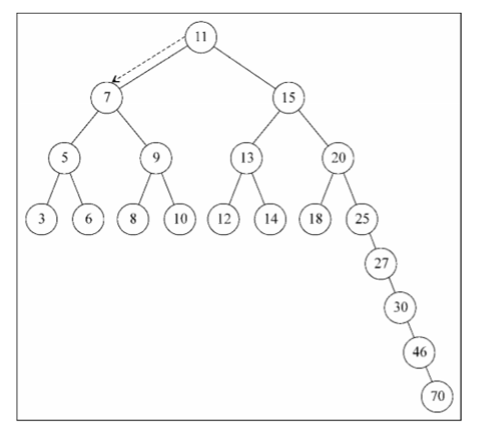

这会在需要在某条边上添加、移除和搜索某个节点时引起一些性能问题。为了解决这个问题，有一种树叫做**阿德尔森-维尔斯和兰迪斯树（AVL树）**。AVL树是一种自平衡二叉搜索树，意思是任何一个节点左右两侧子树的高度之差最多为1。也就是说这种树会在添加或一处节点时尽量试着成为一棵完全树。

我们可以在后面看到它的源码

### 第九章 图 ###

本章我们将会学习另一种非线性数据结构--图，这是我们要学习的最后一种数据结构，下一章将深入学习排序和搜索算法。

本章将会包含不少图的巧妙运用。图是一个庞大的主题，深入探索图的奇妙世界足够费老大劲了

**图的相关术语**

图是网络结构的抽象模型。图是一组由边连接的节点（或顶点）。学习图是重要的，因为任何二元关系都可以用图来表示。

任何社交网络，例如Facebook、Twitter和Google plus，都可以用图表示

我们也可以使用图来表示道路、航班以及通信状态，如下图

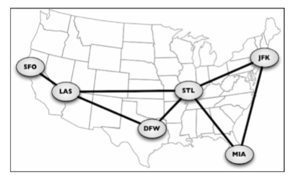

让我们来学习一下图在数学及技术上的概念

一个图**G = ( V, E )**由以下元素组成

	V：一组顶点

	E：一组边，连接V中的顶点

下图表示一个图：

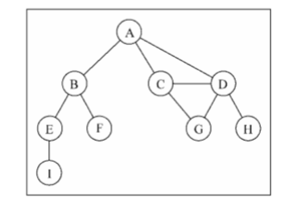

在着手实现算法之前，让我们先了解一下图的一些术语

由一条边连接在一起的顶点称为相邻顶点。比如，A和B是相邻的，A和D是相邻的，A和C是相邻的，A和E不相邻。

一个顶点的度是其相邻顶点的数量。比如，A和其他三个顶点连接，因此，A的度为3；E和其他两个顶点相连，因此，E的度为2.

路径是顶点v1,v2,v3,....vk的一个连续序列，其中vi和vi+1是相邻的。以上一示意图中的图为例子，其中包含路径A B E I 和A C D G。

简单路径要求不包含重复的顶点。举个例子，A D G是一条简单路径。出去最后一个顶点（因为他和第一个顶点是同一个顶点），环也是一个简单路径，比如A D C A（最后一个顶点重新回到A）。

如图中不存在环，则称该图是无环的。如图中每两个顶点间都存在路径，则该图是连通的。

**有向图和无向图**

图可以是无向的（边没有方向）或是有方向的（有向图）。如下图，有向图的边有一个方向

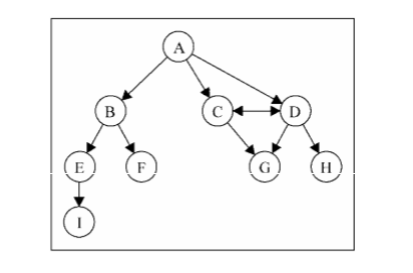

如果图中每两个顶点间在双向上都存在路径，则该图是强连通的。例如，C和D是强连通的，而A和B不是强连通的。

图还可以表示是未加权的（目前为止我们看到的图都是未加权的）或加权的。例如下图，加权图的边被赋予了权值：

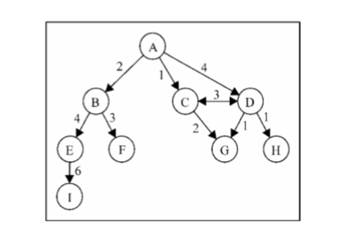

我们可以使用图来解决计算机科学世界中的很多问题，比如搜索图中的一个特定顶点或搜索一条特定边，寻找图中的一条路径（从一个顶点到另一个顶点），寻找两个顶点之间的最短路径，以及环检测。

**图的表示**

从数据结构的角度来说，我们有多种方式来表示图，在所有的表示方法中，不存在绝对正确的方式。图的正确表示法取决于待解决的问题和图的类型。

**邻接矩阵**

图最常见的实现是邻接矩阵。每个节点都和一个整数相关联，该整数将作为数组的索引。我们用一个二维数组来表示顶点之间的连接。如果索引为i的节点和索引为j的节点相邻，则array[i][j] === 1,否则array[i][j] === 0，如下图所示

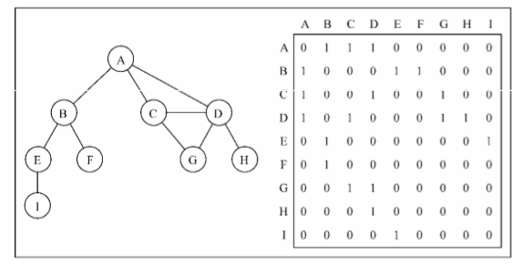

不是强连通的图（稀疏图）如果用邻接矩阵来表示，则矩阵中将会有很多0，这意味着我们浪费了计算机存储空间来表示根本不存在的边。例如，找给定的相邻顶点，即使该顶点只有一个相邻顶点，我们也不得不迭代一整行。邻接矩阵表示法不够好的另一个理由是，图中顶点的数量可能会改变，而二维数组不太灵活。

**邻接表**

我们也可以使用一种叫做邻接表的动态数据结构来表示图。邻接表由图中每个顶点的相邻顶点列表组成。存在好几种方式来表示这种数据结构。我们可以用列表（数组）、链表，甚至是散列表或是字典来表示相邻顶点列表。下面的示意图展示了邻接表数据结构。

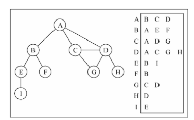

尽管邻接表可能对大多数问题来说是更好的选择，但是=以上两种表示法都很有用，且它们有着不同的性质（例如，要找出顶点v和w是否相邻，使用邻接矩阵会比较快）。我们也会使用邻接表表示法。

**关联矩阵**

我们还可以用关联矩阵来表示图。在关联矩阵中，矩阵的行表示顶点，列表示边。如下图所示，我们使用二维数组来表示两者之间的连通性，如果顶点v是边e的入射点，则array[v][e] === 1,否则，array[v][e] === 0

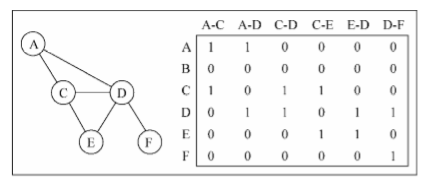

关联矩阵常用于边的数量比顶点多的情况下，以节省空间和内存

**创建图类**

声明类的骨架

	function Graph() {

		var vertices = [];

		var adjList = new Dictionary();
	}

我们使用一个数组来存储图中所有顶点的名字，以及一个字典来存储邻接表。字典将会使用顶点的名字作为键，邻接顶点列表作为值。vertices数组和adjList字典两者都是我们Graph类的私有属性。

接着，我们将实现两个方法：一个用来向图中添加一个新的顶点（因为图实例化后是空的），另外一个方法用来添加顶点之间的边。我们先实现addVertex方法：

	this.addVertex = function( v ) {

		vertices.push( v );

		adjList.set( v, [] );
	};

这个方法接受顶点v作为参数。我们将该顶点添加到顶点列表中，并且在邻接表中，设置顶点v作为键对应的字典值为一个空数组。

现在，我们来实现addEdge方法：

	this.addEdge = function( v, w ) {

		adjList.get( v ).push( w );

		adjList.get( w ).push( v );
	};

这个方法接受两个顶点作为参数。首先，通过将w加入到v的邻接表中，我们添加了一条自顶点v到顶点w的边。如果你想实现一个有向图，则行5就足够了。由于本章的多数例子都是基于无向图的，我们需要添加一条自w向v的边

注意我们只是往数组里新增元素，因为数组已经在行4被初始化了

测试代码

	var graph = new Graph();

	var myVertices = ['A','B','C','D','E','F','G','H','I'];

	for ( var i = 0; i < myVertices.length; i++ ) {

		graph.addVertex( myVertices[i] );
	}

	graph.addEdge('A', 'B');

	graph.addEdge('A', 'C');

	graph.addEdge('A', 'D');

	graph.addEdge('C', 'D');

	graph.addEdge('C', 'G');

	graph.addEdge('D', 'G');

	graph.addEdge('D', 'H');

	graph.addEdge('B', 'E');

	graph.addEdge('B', 'F');

	graph.addEdge('E', 'I');

为方便起见，我们创建了一个数组，包含所有我们想添加到图中的顶点。接下来我们只要遍历vertices数组并将其中的值逐一添加到我们的图中。最后，我们添加想要的边。这段代码将会创建一个图，也就是目前为止本章的示意图所使用的。

为更方便一些，我们来实现一下Graph类的toString方法，以便于在控制台输出图

	this.toString = function() {

		var s = '';

		for ( var i = 0; i < vertices.length; i++ ) {

			s += vertices[i] + '->';

			var neighbors = adjList.get( vertices[i] );

			for ( var j = 0; j < neighbors.length; j++ ) {

				s += neighbors[j] + ' ';
			}

			s += '\n';

		}

		return s;

	};

我们为邻接表表示法构建了一个字符串。首先，迭代vertices数组列表，将顶点的名字加入到字符串中。接着，取得该顶点的邻接表，同样也迭代该邻接表，将相邻顶点加入我们的字符串。邻接表迭代完成后，给我们的字符串添加一个换行符，这样就可以在控制台看到一个漂亮的输出了

	console.log( graph.toString() );

输出结果如下：

	A -> B C D

	B -> A E F

	C -> A D G 

	D -> A C G H

	E -> B I

	F -> B

	G -> C D

	H -> D

	I -> E

一个漂亮的邻接表，从该输出中，我们知道顶点A有这几个相邻顶点： B、C和D

**图的遍历**

和树数据结构类似，我们可以访问图的所有节点。有两种算法可以对图进行遍历：广度优先搜索（Breadth-First Search，BFS）和深度优先搜索（Depth-First Search，DFS）。图的遍历可以用来寻找特定的顶点或寻找两个顶点之间的路径，检查图是否连通，检查图是否含有环等。

在实现算法之前，让我们来更好地理解一下图遍历的思想方法。

图遍历算法的思想是必须追踪每个第一次访问的节点，并且追踪有哪些节点还没有被完全探索。对于两种图遍历算法，都需要明确指出第一个被访问的顶点。

完全探索一个顶点要求我们查看该顶点的每一条边。对于每一条边所连接的没有被访问过的顶点，将其标注为被发现的，并将其加进待访问顶点列表中。

为了保证算法的效率，务必访问每个顶点至多两次。连通图中每条边和顶点都会被访问到。

广度优先搜索算法和深度优先搜索算法基本上是相同的，至有一点不同，那就是待访问顶点列表的数据结构。

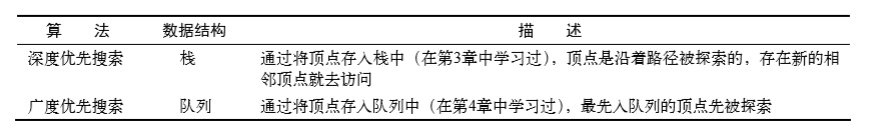

当要标记已经访问过的顶点时，我们用三种颜色来反映他们的状态

白色：表示该顶点还没有被访问过

灰色：表示该顶点被访问过，但并未被探索过

黑色：表示该顶点被访问过且被完全探索过

这就是之前提到的务必访问每个顶点最多两次的原因

**广度优先探索**

广度优先探索算法会从指定的第一个顶点开始遍历图，先访问其所有的相邻点，就像一次访问图的一层。换句话说，就是先宽后深地访问顶点，如下图所示：

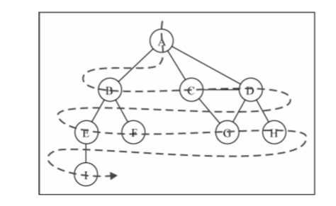

一下是从顶点v开始的广度优先搜索算法所遵循的步骤。

（1）创建一个队列Q。

（2）将v标注为被发现的（灰色），并将v入队列Q。

（3）如果Q非空，则运行一下步骤：

	（a）将u从Q中出队列

	（b）将标注u为被发现的（灰色）

	（c）将u所有未被访问过的邻点（白色）入队列

	（d）将u标注为已被探索的（黑色）

让我们实现广度优先搜索算法：

	var initializeColor = function() {

		var color = [];

		for ( var i = 0; i < vertices.length; i++ ) {

			color[ vertices[i] ] = 'white';//{1

		}

		return color;

	};

	this.bfs = function( v, callback ) {

		var color = initializeColor(),

			queue = new Queue();

		queue.enqueue(v);

		while ( !queue.isEmpty() ) {

			var u = queue.dequeue(),

				neighbprs = adjList.get(u);

			color[u] = 'grey';

			for ( var i = 0; i < neighbors.length; i++ ) {

				var w = neighbors[i];

				if ( color[w] === 'white' ) {

					color [w] = 'grey';

					queue.enqueue(w);

				}
			}

			color[u] = 'black';

			if ( callback ) {

				callback(u);
		
			}

		}

	};

广度优先搜索和深度优先搜索都需要标注被访问过的顶点。为此，我们将使用一个辅助数组color。由于当算法开始执行时，所有的顶点颜色都是白色，所以我们可以创建一个辅助函数initializeColor，为这两个算法执行此初始化操作

让我们深入学习广度优先搜索算法的实现。我们要做的第一件事情是用initializeColor函数来将color数组初始化为white。我们还需要声明和创建一个Queue实例，它将会存储待访问和待探索的顶点

照着本章开头解释过的步骤，bfs方法接受一个顶点作为算法的起始点。起始点是必要的，我们将此顶点入队列。

如果队列非空，我们将通过出队列操作从队列中移除一个顶点，并取得一个包含其所有邻点的邻接表。该顶点将被标注为grey，表示我们发现了它（但还未完成对其的探索）。

对于u的每个邻点，我们取得其值，如果他还为被访问，则将其标注为我们已经发现了它（颜色设置为grey即可），并将这个顶点加入队列中，这样当其从队列中出列的时候，我们可以完成对其的探索。

当完成探索该顶点和其相邻顶点后，我们将该顶点标注为已探索过的（颜色设置为black）。

我们实现的合格bfs方法也接受一个回调（相似于第八章中中遍历树）。这个参数是可选的，如果我们传递了回回调函数，会用它

执行这段代码并测试

	function printNode( value ) {

		console.log( 'Visited vertex:' + value );

	};

	graph.bfs( myVertices[0], printNode );

首先，我们声明了一个回调函数，它仅仅在浏览器控制台上输出已经被完全探索过的顶点的名字。接着，我们会调用bfs方法，给它传递一个顶点（A---从本章开头声明的myVertices数组）和回调函数。当我们执行这段代码时，该算法会在浏览器控制台下输出结果

	Visited vertex: A

	Visited vertex: B

	visited vertex: C

	Visited vertex: D

	Visited vertex: E

	Visited vertex: F

	Visited vertex: G

	Visited vertex: H

	Visited vertex: I

如你所见，顶点被访问的顺序和本节开头的示意图中所展示的一致

**使用BFS寻找最短路径**

目前为止我们展示了BFS算法的工作原理。我们可以用该算法作更多的事情，而不只是输出被访问顶点的顺序。

例如，给定一个图G和源顶点v，找出对每个顶点u，u和v之间最短路径的距离（以边的数量计算）。

对于给定顶点v，广度优先算法会访问所有与其距离为1的顶点，接着是距离为2的顶点，以此类推。所以，可以用广度优先算法类解决这个问题。我们可以修改bfs方法返回给我们一些信息

从v到u的距离d[u]

前溯点pred[u]，用来推导出从v到其他每个顶点u的最短路径

看看如何用广度优先方法实现：

	this.BFS = function( v ) {

		var color = initializeColor(),

			queue = new Queue(),
			
			d = [],

			pred = [];

		queue.enqueue( v );

		for ( var i = 0; i < vertices.length; i++ ) {

			d[ vertices[i] ] = 0;

			pred[ vertices[i] ] = null;

		}

		while ( !queue.isEmpty() ) {

			var u = queue.dequeue(),

				neighbors = adjList.get( u );

			color[u] = 'grey';

			for ( i = 0; i < neighbors.length; i++ ) {

				var w = neighbors[i];

				if ( color[w] === 'white' ) {

					color[w] = 'grey';

					d[w] = d[u] + 1;

					pred[w] = u;

					queue.enqueue(w);

				}

			}

			color[u] = 'black';

		}

		return {

			distances: d,

			predecessors: pred
		};

	};

我们还需要声明数组d来表示距离，以及pred数组来表示前溯点。下一步则是对图中的每一个顶点，用0来初始化数组d，用null来初始化数组pred。

当我们发现顶点u的邻点w时，则设置w的前溯点值为u。我们还通过给d[u]加1来设置v和w之间的距离（u是w的前溯点，d[u]的值已经有了）。

方法的最后返回了一个包含d和pred的对象。

现在，我们可以再次执行BFS方法，并将其返回值存在一个变量中：

	var shortestPathA = graph.BFS( myVertices[0] );

	console.log( shortestPathA );

对顶点A执行BFS方法，以下将会是输出：

	distances: [A: 0, B: 1, C: 1, D: 1, E: 2, F: 2, G: 2, H: 2, I: 3],

	predecessors: [A: null, B: "A", C: "A", D: "A", E: "B", F: "B", G: "C", H: "D", I: "E"]

这意味着顶点A与顶点B、C和D的距离是1；与顶点E、F、G和H的距离为2；与顶点I的距离为3.

通过前溯点数组，我们可以用下面这段代码来构建从顶点A到其他顶点的路径：

	var fromVertex = myVertices[0];

	for ( var i = 1; i < myVertices.length; i++ ) {

		var toVertex = myVertices[i],

			path = new Stack();

		for ( var v = toVertex; v !== fromVertex; v = shortestPathA.predecessors[v] ) {

			path.push(v);
		}

		path.push( fromVertex );

		var s = path.pop();

		while ( !path.isEmpty() ) {

			s += '-' + path.pop();

		}

		console.log(s);

	}

我们用顶点A作为源顶点。对于每个其他顶点（除了顶点A），我们会计算顶点A到它的路径。我们从顶点数组得到toVertex，然后会创建一个栈来存储路径值。

接着，我们追溯到toVertex到fromVertex的路径。变量v被赋值为前溯点的值，遮掩我们就能够反向追溯这条路径。将变量v添加到栈中。最后，源顶点也会被添加到栈中，以得到完整路径。

这之后，我们创建了一个s字符串，并将源顶点赋值给它（它是最后一个加入栈中的，所以它是第一个被弹出的项）。当栈是非空的，我们就从栈中移除一个项并将其拼接到字符串s的后面）。最后在控制台打印。

执行该代码段，得到的结果如下

	A - B
	
	A - C

	A - D

	A - B - E

	A - B - F

	A - C - G

	A - D - H

	A - B - E - I

这里我们得到了从顶点A到图中其他顶点的最短路径（衡量标准是边的数量）

**深入学习最短路径算法**

本章中的图不是加权图。如果计算加权图中的最短路径（例如，城市A和城市B之间的最短路径--GPS和Google中用到的算法），广度优先搜索未必合适。

举些例子，Dijkstra's算法解决了单源最短路径问题。Bellman-Ford算法解决了边权值为负的单源最短路径问题。A*搜索算法解决了求仅一对顶点间的最短路径问题，它用经验法则来加速搜索过程。Floyd-Warshall算法解决了求所有顶点对间的最短路径这一问题。

如本章开头提到的，图是一个广泛的主题，对最短路径问题及其变种问题，我们有很多的解决方案。但在开始学习这些其他解决方案前，我们需要掌握好图的基本概念，这是本章涵盖的内容。而其他解决方案不会讲述。

**深度优先搜索**

深度优先搜索算法将会从第一个指定的顶点开始遍历图，沿着路径直到这条路径最后一个顶点被访问了，接着原路回退并探索下一条路径。换句话说，它是先深度后广度地访问顶点，如下图：

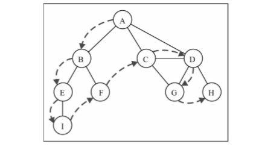

深度优先搜索算法不需要一个源顶点。在深度优先算法中，若图中顶点v未访问，则访问该顶点v

要访问顶点v，要做到如下步骤：

（1）标注v为被发现的（灰色）

（2）对于v的所有未访问的邻点w：
	
	（a）访问顶点w
	
（3）标注v为已被探索的（黑色）

