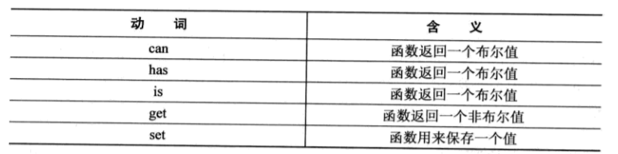

## 第一部分 编程风格 ##

“程序是写给人读的，只是偶尔让机器执行一下“ 		---Donald Knuth

**JSLint和JSHint用来检查编程风格**，避免不规范的操作引起代码中潜在的错误。

JS的语句要么独占一行要么以分号结尾，类似的有C、C++和Java都采用这种行结束写法，以分号结尾。

JavaScript编码风格很少提及行的长度，但是代码规范中指定**一行的长度一般不超过80个字符**。

**换行后，第二行最好有两个缩进**

**添加空行**，方法之间、方法中的局部变量和第一条语句之间、多行或单行注释之前、方法内在的逻辑片段之间，总之谨慎用之。

**变量和函数要简洁并且抓住要点**，例如命名count、length和size表明数据类型是数字，而命名name、title和message表明数据类型是字符串。但单个字符命名的变量诸如i、j和k通常在循环中使用。使用这些能够体现出数据类型的命名，易于别人和自己读懂。注意伪标准的标准。

对于**函数和命名来说，第一个单词应该是动词**，这里有一些使用动词常见的约定：

看看例子：

	if ( isEnabled ) {

		setName("Nicholas");
	}

	if ( getName() === "Nicholas" ) {

		doSomething();
	}

**常量用大写字母加下划线来命名，下划线用来分隔单词**

	var MAX_COUNT = 10,

		URL = "http://www.baidu.com";

JS中，**构造函数是前面冠以new运算符的函数**，用来创建对象。语言本身已经包含了很多内置构造函数，比如Object和RedExp，也可以开发自己的构造函数来生成新类型，构造函数从变量和普通函数区别开来方式有命名用大写字母开始。构造函数的命名常常是名词，因为是用来创建某个类型的实例，如下：

	function Person( name ) {

		this.name = name;
	}

	Person.prototype.sayName = function() {

		alert(this.name);
	};

	var me = new Person("Nicholas");

**字符串分行，行与行之间用 + 连接**

**null**

null是一个特殊值，使用null的场景是：

用来初始化一个变量，这个变量可能赋值为一个对象。

用来和一个已经初始化的变量比较，这个变量可以是也可以不是一个对象。

当函数的参数期望是对象时，用作参数传入。

当函数的返回值期望是对象时，用作返回值传出。

注意：

不要使用null来检测是否传入了某个参数。

不要用null来检测一个未初始化的变量

示例：

	var person = null;

	function getPerson() {

		if ( condition ) {

			return new Person("Nicholas");
		} else {

			return null;
		}
	}

	var person = getPerson();

	if ( person !== null ) {

		doSomething();
	}

理解null最好的方式是将它当作占位符

**undefined**

undefined是一个特殊值，不同于null，不过null = undefined结果为true，不过undefined的用途和前者不同。那些没有被初始化的变量都有一个初始值即undefined，表示这个变量等待被赋值。比如：

	var person;//不妥当的写法

	console.log( person === undefined );//true

	var person;

	console.log( typeof person );//undefined

	console.log( typeof foo );//undefined

上述的代码中，person和foo都会导致typeof返回undefined，哪怕是person和foo在其他场景中的行为千差万别（语句中foo会报错，而使用person不会报错）

通过禁止使用特殊值undefined，可以有效确保只在一种情况下typeof才会返回undefined：当变量未声明。如果你使用了一个可能赋值为一个对象的变量时，其赋值为null。

	var person = null;//right way

	console.log( person === null );//true

将变量初始值赋值为null表明了这个变量的意图，他最终很可能赋值为对象。typeof运算符运算null的类型时返回object，这样就能和undefined区分开了。

对象直接量和数组直接量是推荐的方式。

**使用文档注释时，应当对如下内容添加注释**

**所有的方法**

应当对方法、期望的参数和可能的返回值添加注释描述。

**所有的构造函数**

应当对自定义类型和期望的参数添加描述。

**所有包含文档方法的对象**

如果一个对象包含一个或多个附带文档注释的方法，那么这个对象也应当针对文档生成工具添加文档注释。

**所有的块语句都应当使用花括号**：包括

if、for、while、do...while...、try...catch...finally

for-in循环用来遍历对象属性。不用定义任何控制条件，循环将会遍历每个对象属性，并返回属性名（不是值）

	var prop;
	
	for (prop in object ) {

		console.log("Property name is " + prop);

		console.log("Property value is" + object[prop]);
	}

for-in循环有一个问题，就是它不仅遍历对象的实例属性（instance property），同样还遍历从原型继承来的属性。当遍历自定义对象的属性时，往往会因为意外的结果而终止。出于这个原因，最好使用hasOwnProperty()方法来为for-in方法循环过滤出实例属性。看看下面的例子

	var prop;

	for (prop in object) {

		if (object.hasOwnProperty(prop)) {

			console.log("Property name is" + prop);
			console.log("ProPerty value is" + object[prop]);
		}
	}

**上面的遍历是没有原型链的，如果要原型链也遍历，则不要判断即可。不要用for-in来遍历数组。**

JS编程的本质是编写一个个的函数来完成任务，var语句不论是否真正被执行，所有的var语句都提前到包含这段逻辑的函数的顶部执行。如

	function doSomething() {

		var result = 10 + value;
		var value = 10;
		return result;
	}

上述代码块中，变量value在声明之前就参与了运算，这是合法的，尽管result最后的结果是个特殊值NaN

	function doSomething() {

		var result, value;

		result = 10 + value;
		value = 10;

		return result;
	}

两个var语句提前到函数的顶部，初始化逻辑紧跟其后，JS的执行顺序是从上到下，变量已经提到函数的顶部，不过赋值是以后的事情。ECMA5之前没有块级变量声明（block-level variable declaration）。

**立即调用的函数**

JS中允许声明匿名函数（本身没有命名的函数），并将匿名函数赋值给变量或者属性。

	var doSomething = function() {

		//函数体
	}

这种匿名函数同样可以通过在最后加上一对圆括号来立即执行并返回一个值，然后将这个值赋值给变量。

**严格模式**

ECMA5引入了严格模式（strict mode），以某种方式谨慎地解析执行JS，减少错误，通过下面的指令脚本以严格模式执行

	"use strict";
JS引擎会将其识别为一条指令，以严格模式来解析代码。这条编译指令不仅用于全局，也适用于局部，比如一个函数内。不推荐把它用在全局作用域中。要这么写

	function doSomething() {

		"use strict";

		//代码
	}

如果希望在多个文件应用严格模式又不想写好几次，可以用立即执行的函数。

	(function() {

		"use strict";

		function doSomething() {}

		function doSomethingElse() {}
	})();

**相等**

由于JS具有强制类型转换机制（type coercion），JS中的判断相等操作很微妙。发生强制类型转换最常见的场景是，使用了判断相等运算符==和！=。当比较的两个值的类型不同，这个两个运算符都会有强制转换。

	console.log(5 == "5");//true

	console.log(25 == "0x19");//true

**eval()不推荐使用，除非万不得已**

JS的3种原始包装类型：String、Boolean和Number。每种类型都代表全局作用域的一个构造函数，并分别表示各自对应的原始值的对象。原始包装类型的主要作用是让原始值具有对象般的行为，比如

	var name = "Nicholas";

	console.log(name.toUpperCase());

尽管name是一个字符串，是原始类型不是对象，当仍可以使用诸如toUpperCase()之类的方法，即将字符串当作对象来对待。我们避免使用包装类型。

###第二部分 编程实践###

